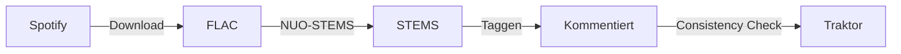

# Momo's Music Manager

Multi-service music library management for DJs — local files + streaming services (Spotify) mit harmonischem Matching, Tag-Organisation und Traktor-Integration.

> **Status**: POC Phase — Funktional aber in aktiver Entwicklung
> **Branch**: `momos-music-manager`

---

## Quick Start

```bash
# 1. Backend starten (Port 3000)
cargo run -- serve

# 2. Frontend starten (separates Terminal, Port 8000)
cd frontend && python3 -m http.server 8000

# 3. Browser öffnen
open http://localhost:8000
```

### Voraussetzungen

- Rust 1.80+ (und Cargo)
- SQLite 3.x
- Python 3 (für den einfachen Dev-Server)
- Spotify Developer Account (für OAuth — optional, nur für Sync)

### Konfiguration

```bash
cp example.env .env
# .env mit Spotify Credentials befüllen (optional)
```

---

## DJ Workflow (aktuell)

Der Kern-Workflow, den Momo's Music Manager abbildet und zukünftig automatisieren soll:



### 1. Spotify → FLAC downloaden

1. Playlist-URL von Spotify kopieren
2. `http://localhost:6596` öffnen (Download-Queue)
3. URL einfügen, warten bis FLACs in `~/Music/flacs/` liegen

### 2. FLAC → STEMS konvertieren

1. NUO-STEMS öffnen
2. "Add Files to queue" → "Folder" → `~/Music/flacs`
3. "Skip duplicates?" → Yes, "Start Processing"
4. STEM-Dateien erscheinen in `~/Music/stems/`

### 3. Metadata taggen (Comment schreiben)

Der Server schreibt beim Sync automatisch Playlist-Informationen in den ID3-Comment. Format:

```
[{Phase}{Mood}{Vibe}] {tags} {source_id}
```

Beispiel: `[PMV] build jazzy warehouse sp:1WSF0LJGwJkYejuMtyJVuA`

### 4. In Traktor importieren

1. Traktor öffnen
2. "Consistency Check" über alle Tracks laufen lassen
3. Comments sind sichtbar → Smart-Lists möglich (z.B. "sunny house")

---

## Pages

| Seite                       | Beschreibung                               |
| --------------------------- | ------------------------------------------ |
| `/index.html`               | Services-Dashboard (Spotify Connect/Sync)  |
| `/files.html`               | Lokale Dateien mit BPM/Key, Comment-Status |
| `/tracks.html`              | Service-Tracks (Spotify)                   |
| `/playlists.html`           | Alle Service-Playlists                     |
| `/folders.html`             | Überwachte Ordner verwalten                |
| `/tags.html`                | Tags (paginierte Liste)                    |
| `/tag-categories.html`      | Tag-Kategorien                             |
| `/tags-from-playlists.html` | Wizard: Playlists → Tags                   |
| `/tasks.html`               | Task-Manager (Sync/Write-Comment Jobs)     |

---

## API Endpoints (Übersicht)

| Gruppe    | Prefix                                  |
| --------- | --------------------------------------- |
| Files     | `GET/POST /api/files`                   |
| Tracks    | `GET /api/tracks`                       |
| Playlists | `GET /api/playlists`                    |
| Tags      | `CRUD /api/tags`, `/api/tag-categories` |
| Folders   | `CRUD /api/folders`                     |
| Services  | `GET/POST /api/services/spotify/...`    |
| Tasks     | `GET/DELETE /api/tasks`                 |

---

## Projekt-Struktur

```
src/                    # Rust Backend
├── main.rs             # Einstieg, CLI, Router
├── db.rs               # Datenbank-Funktionen
├── api.rs              # API Endpoints
├── comment.rs          # Comment-Parsing/-Generierung
├── audio_extensions.rs # Audio-Enum
├── config.rs           # Konfiguration
├── watch.rs            # File Watcher
├── spotify/            # Spotify OAuth + Sync
├── sync/               # Sync-Manager
└── tasks/              # Generischer Task-Manager

frontend/               # HTML/JS Frontend (POC)
├── index.html          # Hauptseite
├── files.html/js       # Dateien
├── tracks.html/js      # Service-Tracks
├── playlists.html/js   # Playlists
├── folders.html/js     # Ordner
├── tags.html/js        # Tags
├── tag-categories.html # Tag-Kategorien
├── tags-from-playlists.html # Playlist→Tag Wizard
├── tasks.html/js       # Task-WebUI
└── style.css           # Styles

migrations/
└── 001_initial_schema.sql  # Single Migration

docs/
├── ARCHITECTURE.md     # System-Architektur
├── COMMENT_SYSTEM.md   # Comment-Format Spezifikation
├── DECISIONS.md        # Architectural Decision Records
├── TASK_MANAGER.md     # Task-Manager Design
└── schema.sql          # DB Schema Referenz
```

---

## Nützliche Kommandos

```bash
# Server killen (wenn Port belegt)
./kill-all.sh

# Single File scannen (Debug)
cargo run -- scan-file ~/Music/stems/example.stem.m4a

# Clean DB (bei Schema-Änderungen)
rm -f app.db && cargo run -- serve
```

---

## Docs

- [`docs/ARCHITECTURE.md`](docs/ARCHITECTURE.md) — System-Design
- [`docs/DECISIONS.md`](docs/DECISIONS.md) — Technische Entscheidungen
- [`docs/COMMENT_SYSTEM.md`](docs/COMMENT_SYSTEM.md) — Comment-Format
- [`docs/TASK_MANAGER.md`](docs/TASK_MANAGER.md) — Task-Manager Architektur
- [`docs/schema.sql`](docs/schema.sql) — Datenbank-Schema

---

## License & Repo

Fork von Spotify Mirror. Neues Repository:
`git@git.sr.ht:~momoy/momos-music-manager`
