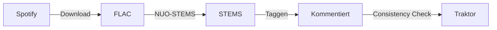

# momo's music manager

> Multi-service music library management for DJs — local files + Spotify streaming with harmonic matching, tag organization, and Traktor integration.

---

## Quick Start

```bash
# Start the server (frontend embedded, one binary)
cargo run -- serve

# Open in browser
open http://localhost:3000
```

---

## Website / Landing Page

The project has a static landing page (features, screenshots, download button)
deployed to GitHub Pages:

- **URL:** <https://momokli.github.io/momos-music-manager/>
- **Source:** [`site/`](site/) — plain HTML/CSS, no build step
- **Deploy:** [`.github/workflows/pages.yml`](.github/workflows/pages.yml) —
  runs on every push to `main` that touches `site/**`

The landing page now has **download buttons for all supported platforms**
(macOS universal DMG, Windows x64 + arm64 zip, Linux x64 + arm64 tar.gz),
each with a SHA256 checksum link and verification instructions, pointing at
**stable asset names** on the rolling `latest-main` pre-release (the CI
uploads e.g. `momos-music-manager-latest-linux-x64.tar.gz` under that stable
name on every main build):

- <https://github.com/momokli/momos-music-manager/releases/tag/latest-main>
- <https://github.com/momokli/momos-music-manager/releases/download/latest-main/SHA256SUMS>

The `latest-main` release carries **Linux (x64 + arm64) tar.gz and
Windows (x64 + arm64) zip** artifacts with checksums — see
[docs/PLATFORM-SUPPORT.md](docs/PLATFORM-SUPPORT.md) for the full matrix and
[docs/RELEASE-ROADMAP.md](docs/RELEASE-ROADMAP.md) for the iterative next
steps (versioned releases, code signing, notarization, AppImage).

A custom domain (e.g. `mmm.simonklimke.de`) is intentionally **not** configured
— the DNS entry is managed by the home `home_domains.txt` script on the
Fritz!Box and would collide with it. It can be added later via a `CNAME` file
plus a DNS exception.

---

### Prerequisites

- Rust 1.85+ (and Cargo) — the project uses the Rust 2024 edition
- Spotify Developer Account (optional, only for sync features)

SQLite is compiled in (sqlx `bundled`) and TLS uses rustls — **no system
SQLite/OpenSSL development packages needed** on any platform.

No Python, Node.js, or separate dev server needed. The entire frontend is embedded in the binary via `rust-embed`.

---

## Configuration

Configuration sources (highest priority wins):

1. **Environment variables** — set directly or via `.env` file
2. **`~/.config/momos-music-manager/config.toml`** — persistent config
3. **Built-in defaults**

### config.toml

```toml
[database]
url = "sqlite:~/.local/share/momos-music-manager/library.db"

[server]
host = "127.0.0.1"
port = 3000
# public_url = "https://mmm.mydomain.de"   # optional, for OAuth behind reverse proxy

[spotify]
client_id     = "your_spotify_client_id"
client_secret = "your_spotify_client_secret"
redirect_uri  = "http://localhost:3000/callback"

[soundcloud]
api_key  = "your_soundcloud_api_key"
user_id  = "your_soundcloud_user_id"

[youtube]
api_key      = "your_youtube_api_key"
playlist_id  = "your_youtube_playlist_id"

[autoupdate]
enabled = true
# base_url = "https://github.com/momokli/momos-music-manager/releases/download/latest-main"
# health_grace_secs = 60
```

### Environment variables (override config.toml)

| Variable                | Description                                         |
| ----------------------- | --------------------------------------------------- |
| `DATABASE_URL`          | Database URL, e.g. `sqlite:~/.../library.db`        |
| `SPOTIFY_CLIENT_ID`     | Spotify OAuth client ID                             |
| `SPOTIFY_CLIENT_SECRET` | Spotify OAuth client secret                         |
| `SPOTIFY_REDIRECT_URI`  | Spotify OAuth redirect URI                          |
| `PUBLIC_URL`            | Public URL for OAuth callbacks behind reverse proxy |
| `HOST`                  | Server bind address                                 |
| `PORT`                  | Server port                                         |
| `RUST_LOG`              | Log level (debug, info, warn, error)                |
| `MOMOS_AUTOUPDATE_ENABLED` | Enable the startup update check (`true`/`false`, default `true`) |
| `MOMOS_AUTOUPDATE_BASE_URL` | Autoupdate channel base URL (default is channel-dependent: dev builds → `latest-main`, release builds → `releases/latest`; see [docs/versioning.md](docs/versioning.md)) |
| `MOMOS_AUTOUPDATE_HEALTH_GRACE_SECS` | Seconds the new binary must stay healthy before an update is committed (default `60`) |

---

## Installation

### macOS (DMG)

Download the latest `Momo's-Music-Manager-v*.dmg` from
[GitHub Releases](https://github.com/momo/momos-music-manager/releases).

1. Open the DMG
2. Drag **momo's music manager** to the **Applications** folder
3. Double-click the app — the server starts and your browser opens to the dashboard

> **First launch**: macOS Gatekeeper may block unsigned apps. Right-click the app
> and select **Open**, then click **Open** in the dialog.

#### Latest main (rolling build)

Every push to `main` triggers a CI build that packages the current state for
**all platforms** (Linux x64/arm64, Windows x64/arm64, macOS universal) and
publishes them as a rolling pre-release:

- **Download:** <https://github.com/momokli/momos-music-manager/releases/tag/latest-main>
- **Naming:** versioned `momos-music-manager-<version>-<os-arch>.<ext>` (dev builds:
  `<cargo-version>-dev+<sha8>`, the short commit SHA identifies the exact state) plus
  stable `momos-music-manager-latest-<os-arch>.<ext>` names, each with a `.sha256`
  file; aggregate `SHA256SUMS` + `SHA256SUMS.minisig`. Full schema, channels and the
  release process: [docs/versioning.md](docs/versioning.md).

Same caveat as the tagged releases: macOS builds are **ad-hoc signed, not
notarized**, so Gatekeeper may block them on first launch — right-click the app
and select **Open**. Windows builds are unsigned (SmartScreen warning possible).
Artifacts are also attached to the workflow run (`mmm-<os>-<arch>`).

The server runs in the background (no dock icon). Re-opening the app just brings
back the browser. To stop the server, use Activity Monitor or `pkill momos-music-manager`.

Logs: `~/Library/Logs/momos-music-manager/`
Config: `~/.config/momos-music-manager/config.toml`
Database: `~/.local/share/momos-music-manager/library.db`

### Linux (tar.gz)

Grab `momos-music-manager-<version>-linux-x64.tar.gz` (or `-linux-arm64` for
ARM — Raspberry Pi, NAS, ARM servers) from
[GitHub Releases](https://github.com/momokli/momos-music-manager/releases/tag/latest-main),
verify the checksum, unpack and run — the binary is fully self-contained
(SQLite and TLS compiled in, no system libs beyond the base OS):

```bash
curl -LO https://github.com/momokli/momos-music-manager/releases/download/latest-main/momos-music-manager-latest-linux-x64.tar.gz
curl -LO https://github.com/momokli/momos-music-manager/releases/download/latest-main/momos-music-manager-latest-linux-x64.tar.gz.sha256
sha256sum -c momos-music-manager-latest-linux-x64.tar.gz.sha256
tar -xzf momos-music-manager-latest-linux-x64.tar.gz
```

Run the server (headless — no GUI, no tray on Linux):

```bash
./momos-music-manager serve --host 0.0.0.0 --port 3000 --no-browser
# open http://<host>:3000 in any browser
```

#### Build from source on Linux

```bash
# Debian/Ubuntu: nothing extra needed (SQLite bundled, TLS via rustls)
cargo build --release
target/release/momos-music-manager serve --host 127.0.0.1 --port 3000 --no-browser
```

Cross-build for ARM64 (needs the cross C compiler):

```bash
sudo apt-get install gcc-aarch64-linux-gnu
CC_aarch64_unknown_linux_gnu=aarch64-linux-gnu-gcc \
CXX_aarch64_unknown_linux_gnu=aarch64-linux-gnu-g++ \
  cargo build --release --target aarch64-unknown-linux-gnu
```

#### Systemd (server mode, auto-start)

The package ships a systemd unit (`deploy/momos-music-manager.service`, also in
the tar.gz under `deploy/`) for running the headless server as a service:

```bash
sudo install -m 0644 deploy/momos-music-manager.service /etc/systemd/system/
sudo systemctl edit momos-music-manager   # set User + secrets (SPOTIFY_*, etc.)
sudo systemctl daemon-reload
sudo systemctl enable --now momos-music-manager
sudo systemctl status momos-music-manager
```

### Windows (zip)

Download `momos-music-manager-<version>-windows-x64.zip` (or `-windows-arm64`)
from the [latest-main release](https://github.com/momokli/momos-music-manager/releases/tag/latest-main),
unzip, and run from a terminal:

```powershell
.\momos-music-manager.exe serve --host 0.0.0.0 --port 3000 --no-browser
# open http://<host>:3000
```

> Note: builds are unsigned — SmartScreen may show a warning ("More info → Run
yet"). For background operation use Task Scheduler or NSSM.

### From Source

```bash
# Start the server (frontend embedded, one binary)
cargo run -- serve

# Open in browser
open http://localhost:3000
```

## Deployment

### Auto-Updates (M6)

The app can update itself. Two channels exist, and a build never auto-updates
across them (channel guards):

- **Dev builds** (`<version>-dev+<sha8>`, rolling `main`) check the
  `latest-main` pre-release — every push to `main` is offered as an update
  (detected via the commit SHA in the version).
- **Release builds** (plain semver, tagged `v*`) check the newest release via
  `releases/latest`.

Updates are **never installed silently**: the startup check only reports, and
the actual install is explicit (`momos-music-manager update apply`).

Verification chain (nothing is installed unless every step passes):

1. Download `SHA256SUMS` + `SHA256SUMS.minisig` over HTTPS (rustls).
2. Verify the **Ed25519 signature** (minisign format) of the manifest with the
   public key embedded in the binary (`src/autoupdate/keys.rs`, mirrored in
   `scripts/minisign.pub`).
3. Resolve the platform artifact by its **versioned** name
   (`momos-music-manager-<version>-<os-arch>.<ext>`) and compare versions
   (semver) against the running build; a channel mismatch (dev ↔ release) is
   refused.
4. On `update apply`: download the artifact, verify its **SHA256** against the
   signed manifest, extract the binary — and only then swap.

Swap safety (Linux/Windows): the previous binary is kept as
`momos-music-manager.bak` next to the new one, with an `update-state.json`
marker. On the next start the new binary must survive a health grace period
(default 60 s, with a self-probe of `/api/health`); then the update is
committed (`.bak` removed). If the new binary repeatedly fails to become
healthy, the updater **auto-rolls back** to the previous version. Manual
rollback is always available:

```bash
# check for updates (verifies the signed manifest, no download)
momos-music-manager update check

# download + verify + install (restart the server afterwards)
momos-music-manager update apply

# restore the previous binary from .bak
momos-music-manager update rollback

# current version, channel (base URL), pending update state
momos-music-manager update status
```

Opt-out: `--no-autoupdate` on `serve`, or `MOMOS_AUTOUPDATE_ENABLED=false`
(env / `[autoupdate] enabled = false` in config.toml). The update check also
runs automatically on `serve` startup (10 s after boot) and logs the result.

> **macOS**: the updater downloads and verifies the universal DMG, but does not
> swap binaries inside the `.app` bundle yet (requires M4/notarization work) —
> it prints the verified download path for manual installation.
>
> **Windows**: replacing a *running* executable is not allowed — stop the
> server before `update apply` (the error message tells you).
>
> **Signing key**: the manifest is signed in CI with the `MINISIGN_SECRET_KEY`
> secret (base64 of the `minisign.key` file, see
> [`docs/RELEASE-ROADMAP.md`](docs/RELEASE-ROADMAP.md) M6 for generation &
> rotation). If the secret is not configured, artifacts stay unsigned and the
> updater **refuses** them (safe default).

### Database path

By default, the database is stored at `~/.local/share/momos-music-manager/library.db`.
Override via `[database].url` in config.toml or the `DATABASE_URL` env var.

### macOS Launch Agent (auto-start)

Install a launchd agent to start the server automatically on login:

```bash
# Install (creates plist + loads into launchd)
cargo run -- install-launch-agent

# Check status
cargo run -- service-status

# Uninstall
cargo run -- uninstall-launch-agent
```

### macOS Launch Agent (auto-start on login)

Install a launchd agent to start the server automatically on login:

```bash
# Install (creates plist + loads into launchd)
cargo run -- install-launch-agent

# Check status
cargo run -- service-status

# Uninstall
cargo run -- uninstall-launch-agent
```

The agent will:

- Start on login (`RunAtLoad`)
- Restart on crash (`KeepAlive`)
- Log to `~/Library/Logs/momos-music-manager/`

### Reverse proxy (optional)

When running behind a reverse proxy (nginx, Caddy, etc.), use the `--public-url` flag
so Spotify OAuth callbacks redirect correctly:

```bash
cargo run -- serve --public-url https://mmm.mydomain.de
```

---

## CLI

```bash
# Start server
cargo run -- serve [--host 127.0.0.1] [--port 3000] [--public-url URL] [--no-autoupdate]

# Self-update (M6)
cargo run -- update check
cargo run -- update apply
cargo run -- update rollback
cargo run -- update status

# Database management
cargo run -- db-status
cargo run -- dump [--output FILE]
cargo run -- restore [--input FILE]

# File operations
cargo run -- scan-file /path/to/file.stem.m4a
cargo run -- scan /path/to/music

# macOS launch agent
cargo run -- install-launch-agent
cargo run -- uninstall-launch-agent
cargo run -- service-status

# Version
cargo run -- --version
```

---

## Development

```bash
# Run the test suite (some tests shell out to external tools)
# Debian/Ubuntu: sudo apt-get install flac exiftool ffmpeg
cargo test
# Clean DB (for schema changes)
rm -f app.db && cargo run -- serve

# Spotify API caching (record/replay — no API calls during replay)
SPOTIFY_API_CACHE=record cargo run -- serve
SPOTIFY_API_CACHE=replay cargo run -- serve
rm -rf dev-data/spotify-api

# Folder scan caching
SCAN_CACHE=record cargo run -- serve
SCAN_CACHE=replay cargo run -- serve
rm -rf dev-data/scan-cache

# DB dump/restore (save state before deleting app.db)
cargo run -- dump
cargo run -- restore
```

---

## DJ Workflow



### 1. Spotify → FLAC download

Copy a Spotify playlist URL → add to download queue → FLACs land in `~/Music/flacs/`

### 2. FLAC → STEMS convert

Open NUO-STEMS → add `~/Music/flacs` folder → "Skip duplicates?" → Start → STEM files appear in `~/Music/stems/`

### 3. Tag metadata (write comment)

The server writes playlist information into the ID3 comment on sync:

```
[{Phase}{Mood}{Vibe}] {tags} {source_id}
```

Example: `[PMV] build jazzy warehouse sp:1WSF0LJGwJkYejuMtyJVuA`

### 4. Import into Traktor

Open Traktor → run "Consistency Check" over all tracks → Comments visible → Smart Lists possible

---

## SPA Pages

| Route              | Module                     | Description                              |
| ------------------ | -------------------------- | ---------------------------------------- |
| `#dashboard`       | `pages/dashboard.js`       | Stats + Services dashboard               |
| `#files`           | `pages/files.js`           | Local files with BPM/Key, comment status, STEMS filter |
| `#tracks`          | `pages/tracks.js`          | Service tracks, playlist/tag/PMV filter  |
| `#playlists`       | `pages/playlists.js`       | All service playlists                    |
| `#tags`            | `pages/tags.js`            | Tags (paginated list)                    |
| `#tag-categories`  | `pages/tag-categories.js`  | Tag categories                           |
| `#services`        | `pages/services.js`        | Service status + OAuth/Sync              |
| `#folders`         | `pages/folders.js`         | Managed folder configuration             |
| `#tasks`           | `pages/tasks.js`           | Task manager (sync/write-comment jobs)   |
| `#auto-categorize` | `pages/auto-categorize.js` | AI tag categorization wizard             |
| `#traktor-import`  | `pages/traktor-import.js`  | Traktor collection import                |
| `#digging`         | `pages/digging.js`         | Digging curator — chain-based sessions   |
| `#data`            | `pages/data.js`            | Import/Export database                   |
| `#tag-curation`    | `pages/tag-curation.js`    | Tag parent curation workflow             |

---

## API Endpoints

| Group       | Base Path                                                                        |
| ----------- | -------------------------------------------------------------------------------- |
| Files       | `GET/POST /api/files`                                                            |
| Tracks      | `GET /api/tracks`                                                                |
| Playlists   | `GET /api/playlists`                                                             |
| Tags        | `CRUD /api/tags`, `/api/tag-categories`                                          |
| Folders     | `CRUD /api/folders`                                                              |
| Services    | `GET/POST /api/services/{service}/...`                                           |
| Tasks       | `GET/DELETE /api/tasks`                                                          |
| Data        | `GET /api/dump`, `POST /api/restore`                                             |
| Curation    | `GET /api/tags/curation-queue`                                                   |
| Version     | `GET /api/version`                                                               |
| Parents     | `GET/PUT /api/tags/{id}/parents`                                                 |
| Corrections | `GET/PUT /api/files/{id}/track-corrections`, `/api/tracks/{id}/file-corrections` |
| Digging     | `GET/POST /api/digging/...`                                                      |
| Health      | `GET /api/health`                                                                |

See [`docs/ARCHITECTURE.md`](docs/ARCHITECTURE.md) for details.

---

## Documentation

- [`docs/ARCHITECTURE.md`](docs/ARCHITECTURE.md) — System design
- [`docs/DECISIONS.md`](docs/DECISIONS.md) — Architectural Decision Records
- [`docs/COMMENT_SYSTEM.md`](docs/COMMENT_SYSTEM.md) — Comment format specification
- [`docs/TASK_MANAGER.md`](docs/TASK_MANAGER.md) — Task manager design
- [`docs/USER_STORY.md`](docs/USER_STORY.md) — Core user story

---

## Project Structure

```
momos-music-manager/
├── src/                    # Rust Backend
│   ├── main.rs             # CLI, Router, embedded Frontend
│   ├── api.rs              # All API endpoints
│   ├── db.rs               # DB queries, scanning, comment computation
│   ├── comment.rs          # Comment parsing/generation
│   ├── config.rs           # Config.toml + env var loading
│   ├── embeddings.rs       # Semantic tag embeddings (candle/ML)
│   ├── digging.rs          # Curator/session-builder
│   ├── audio_extensions.rs # AudioExtension enum
│   ├── scan_cache.rs       # File scan caching (record/replay)
│   ├── dump.rs             # DB dump/restore (JSON)
│   ├── poller.rs           # Playlist subscription poller
│   ├── traktor.rs          # Traktor collection.nml parser
│   ├── watch.rs            # Folder watcher (optional)
│   ├── download_guarantor.rs # Auto-remediation for 100% file coverage
│   ├── external_tools.rs   # Resolve metaflac/exiftool/ffmpeg/ffprobe paths
│   ├── global_poller.rs    # Global playlist poller
│   ├── tray.rs             # macOS menu bar tray icon
│   ├── telemetry/          # HTTPS telemetry push + receiver
│   ├── spotify/            # Spotify OAuth + Sync
│   │   ├── client.rs
│   │   ├── models.rs
│   │   ├── replay.rs
│   │   └── sync_worker.rs
│   └── tasks/              # TaskManager + workers
│       └── mod.rs
├── download-service/       # Python download pipeline (deemix + spotDL)
├── scripts/                # Packaging: macOS DMG, Linux tar.gz, Windows zip
├── frontend/               # SPA (embedded via rust-embed)
│   ├── index.html          # Shell
│   ├── app.js              # Hash router
│   ├── style.css           # Styles
│   ├── fontawesome/        # Local Font Awesome bundle
│   ├── shared/             # Reusable modules
│   │   ├── api.js
│   │   ├── components.js
│   │   ├── format.js
│   │   ├── nav.js
│   │   └── search-filter.js
│   └── pages/              # One JS module per route
│       ├── dashboard.js
│       ├── files.js
│       ├── tracks.js
│       ├── playlists.js
│       ├── tags.js
│       ├── tag-categories.js
│       ├── tag-curation.js
│       ├── services.js
│       ├── tasks.js
│       ├── folders.js
│       ├── data.js
│       ├── auto-categorize.js
│       ├── digging.js
│       └── traktor-import.js
├── migrations/
│   ├── 001_initial_schema.sql             # Initial schema
│   ├── 002_playlist_fetch_tracking.sql    # Playlist sync tracking + tag parent resolution
│   ├── 003_remote_unique_count.sql        # Remote unique track count column
│   ├── 004_unique_tags_nocase.sql         # Case-insensitive unique constraint on tags
│   └── 005_v_playlist_tag_category.sql   # Playlist→tag→category resolution view
└── docs/
    ├── ARCHITECTURE.md     # System architecture
    ├── COMMENT_SYSTEM.md   # Comment format spec
    ├── DECISIONS.md        # Architectural Decision Records
    └── TASK_MANAGER.md     # Task manager design
```

---

## Important

- **Delete old DB files** after schema changes: `rm -f app.db*`
- **Column config**: uses `columnConfig_v2_` localStorage key (pixel-based); old percentage-based config is ignored
- If you see "migration 27" errors: delete all DB files and restart
- Migrations are additive (`001_initial_schema.sql` through `023_file_track_corrections.sql`)
- SoundCloud and YouTube OAuth are not yet implemented
- Playlist subscriptions poll every 30 seconds in the background
- The digging page (`digging.html`) is a standalone page, not part of the SPA

---

## License & Repo

Fork of Spotify Mirror.  
`git@git.sr.ht:~momoy/momos-music-manager`
