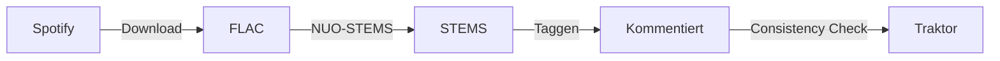

# Momo's Music Manager

> Multi-service music library management for DJs — local files + Spotify streaming with harmonic matching, tag organization, and Traktor integration.

---

## Quick Start

```bash
# Start the server (frontend embedded, one binary)
cargo run -- serve

# Open in browser
open http://localhost:3000
```

### Prerequisites

- Rust 1.80+ (and Cargo)
- SQLite 3.x
- Spotify Developer Account (optional, only for sync features)

No Python, Node.js, or separate dev server needed. The entire frontend is embedded in the binary via `rust-embed`.

---

## Configuration

Configuration sources (highest priority wins):

1. **Environment variables** — set directly or via `.env` file
2. **`~/.config/momos-music-manager/config.toml`** — persistent config
3. **Built-in defaults**

### config.toml

```toml
[database]
url = "sqlite:~/.local/share/momos-music-manager/library.db"

[server]
host = "127.0.0.1"
port = 3000
# public_url = "https://mmm.mydomain.de"   # optional, for OAuth behind reverse proxy

[spotify]
client_id     = "your_spotify_client_id"
client_secret = "your_spotify_client_secret"
redirect_uri  = "http://localhost:3000/callback"

[soundcloud]
api_key  = "your_soundcloud_api_key"
user_id  = "your_soundcloud_user_id"

[youtube]
api_key      = "your_youtube_api_key"
playlist_id  = "your_youtube_playlist_id"
```

### Environment variables (override config.toml)

| Variable                | Description                                         |
| ----------------------- | --------------------------------------------------- |
| `DATABASE_URL`          | Database URL, e.g. `sqlite:~/.../library.db`        |
| `SPOTIFY_CLIENT_ID`     | Spotify OAuth client ID                             |
| `SPOTIFY_CLIENT_SECRET` | Spotify OAuth client secret                         |
| `SPOTIFY_REDIRECT_URI`  | Spotify OAuth redirect URI                          |
| `PUBLIC_URL`            | Public URL for OAuth callbacks behind reverse proxy |
| `HOST`                  | Server bind address                                 |
| `PORT`                  | Server port                                         |
| `RUST_LOG`              | Log level (debug, info, warn, error)                |

---

## Deployment

### Database path

By default, the database is stored at `~/.local/share/momos-music-manager/library.db`.
Override via `[database].url` in config.toml or the `DATABASE_URL` env var.

### macOS Launch Agent (auto-start)

Install a launchd agent to start the server automatically on login:

```bash
# Install (creates plist + loads into launchd)
cargo run -- install-launch-agent

# Check status
cargo run -- service-status

# Uninstall
cargo run -- uninstall-launch-agent
```

The agent will:

- Start on login (`RunAtLoad`)
- Restart on crash (`KeepAlive`)
- Log to `~/Library/Logs/momos-music-manager/`

### Reverse proxy (optional)

When running behind a reverse proxy (nginx, Caddy, etc.), use the `--public-url` flag
so Spotify OAuth callbacks redirect correctly:

```bash
cargo run -- serve --public-url https://mmm.mydomain.de
```

---

## CLI

```bash
# Start server
cargo run -- serve [--host 127.0.0.1] [--port 3000] [--public-url URL]

# Database management
cargo run -- db-status
cargo run -- dump [--output FILE]
cargo run -- restore [--input FILE]

# File operations
cargo run -- scan-file /path/to/file.stem.m4a
cargo run -- scan /path/to/music

# macOS launch agent
cargo run -- install-launch-agent
cargo run -- uninstall-launch-agent
cargo run -- service-status

# Version
cargo run -- --version
```

---

## Development

```bash
# Clean DB (for schema changes)
rm -f app.db && cargo run -- serve

# DB dump/restore (save state before deleting app.db)
cargo run -- dump
cargo run -- restore
```

---

## DJ Workflow



### 1. Spotify → FLAC download

Copy a Spotify playlist URL → add to download queue → FLACs land in `~/Music/flacs/`

### 2. FLAC → STEMS convert

Open NUO-STEMS → add `~/Music/flacs` folder → "Skip duplicates?" → Start → STEM files appear in `~/Music/stems/`

### 3. Tag metadata (write comment)

The server writes playlist information into the ID3 comment on sync:

```
[{Phase}{Mood}{Vibe}] {tags} {source_id}
```

Example: `[PMV] build jazzy warehouse sp:1WSF0LJGwJkYejuMtyJVuA`

### 4. Import into Traktor

Open Traktor → run "Consistency Check" over all tracks → Comments visible → Smart Lists possible

---

## SPA Pages

| Route              | Module                     | Description                              |
| ------------------ | -------------------------- | ---------------------------------------- |
| `#dashboard`       | `pages/dashboard.js`       | Stats + Services dashboard               |
| `#files`           | `pages/files.js`           | Local files with BPM/Key, comment status |
| `#tracks`          | `pages/tracks.js`          | Service tracks (Spotify)                 |
| `#playlists`       | `pages/playlists.js`       | All service playlists                    |
| `#tags`            | `pages/tags.js`            | Tags (paginated list)                    |
| `#tag-categories`  | `pages/tag-categories.js`  | Tag categories                           |
| `#services`        | `pages/services.js`        | Service status + OAuth/Sync              |
| `#folders`         | `pages/folders.js`         | Managed folder configuration             |
| `#tasks`           | `pages/tasks.js`           | Task manager (sync/write-comment jobs)   |
| `#auto-categorize` | `pages/auto-categorize.js` | AI tag categorization wizard             |
| `#traktor-import`  | `pages/traktor-import.js`  | Traktor collection import                |
| `#digging`         | `pages/digging.js`         | Digging curator — chain-based sessions   |

---

## API Endpoints

| Group     | Base Path                               |
| --------- | --------------------------------------- |
| Files     | `GET/POST /api/files`                   |
| Tracks    | `GET /api/tracks`                       |
| Playlists | `GET /api/playlists`                    |
| Tags      | `CRUD /api/tags`, `/api/tag-categories` |
| Folders   | `CRUD /api/folders`                     |
| Services  | `GET/POST /api/services/{service}/...`  |
| Tasks     | `GET/DELETE /api/tasks`                 |
| Digging   | `GET/POST /api/digging/...`             |
| Health    | `GET /api/health`                       |

See [`docs/ARCHITECTURE.md`](docs/ARCHITECTURE.md) for details.

---

## Documentation

- [`docs/ARCHITECTURE.md`](docs/ARCHITECTURE.md) — System design
- [`docs/DECISIONS.md`](docs/DECISIONS.md) — Architectural Decision Records
- [`docs/COMMENT_SYSTEM.md`](docs/COMMENT_SYSTEM.md) — Comment format specification
- [`docs/TASK_MANAGER.md`](docs/TASK_MANAGER.md) — Task manager design

---

## Project Structure

```
momos-music-manager/
├── src/                    # Rust Backend
│   ├── main.rs             # CLI, Router, embedded Frontend
│   ├── api.rs              # All API endpoints
│   ├── db.rs               # DB queries, scanning, comment computation
│   ├── comment.rs          # Comment parsing/generation
│   ├── config.rs           # Config.toml + env var loading
│   ├── embeddings.rs       # Semantic tag embeddings (candle/ML)
│   ├── digging.rs          # Curator/session-builder
│   ├── audio_extensions.rs # AudioExtension enum
│   ├── dump.rs             # DB dump/restore (JSON)
│   ├── poller.rs           # Playlist subscription poller
│   ├── traktor.rs          # Traktor collection.nml parser
│   ├── watch.rs            # Folder watcher (optional)
│   ├── spotify/            # Spotify OAuth + Sync
│   │   ├── client.rs
│   │   ├── models.rs
│   │   └── sync_worker.rs
│   └── tasks/              # TaskManager + workers
│       └── mod.rs
├── frontend/               # SPA (embedded via rust-embed)
│   ├── index.html          # Shell
│   ├── app.js              # Hash router
│   ├── style.css           # Styles
│   ├── fontawesome/        # Local Font Awesome bundle
│   ├── shared/             # Reusable modules
│   │   ├── api.js
│   │   ├── components.js
│   │   ├── format.js
│   │   ├── nav.js
│   │   └── search-filter.js
│   └── pages/              # One JS module per route
│       ├── dashboard.js
│       ├── files.js
│       ├── tracks.js
│       ├── playlists.js
│       ├── tags.js
│       ├── tag-categories.js
│       ├── services.js
│       ├── tasks.js
│       ├── folders.js
│       ├── auto-categorize.js
│       ├── digging.js
│       └── traktor-import.js
├── migrations/
│   └── 001_initial_schema.sql  # Single migration
└── docs/
    ├── ARCHITECTURE.md     # System architecture
    ├── COMMENT_SYSTEM.md   # Comment format spec
    ├── DECISIONS.md        # Architectural Decision Records
    └── TASK_MANAGER.md     # Task manager design
```

---

## Important

- **Delete old DB files** after schema changes: `rm -f app.db*`
- If you see "migration 27" errors: delete all DB files and restart
- SoundCloud and YouTube OAuth are not yet implemented
- Playlist subscriptions poll every 30 seconds in the background
- The digging page (`digging.html`) is a standalone page, not part of the SPA

---

## License & Repo

Fork of Spotify Mirror.  
`git@git.sr.ht:~momoy/momos-music-manager`
