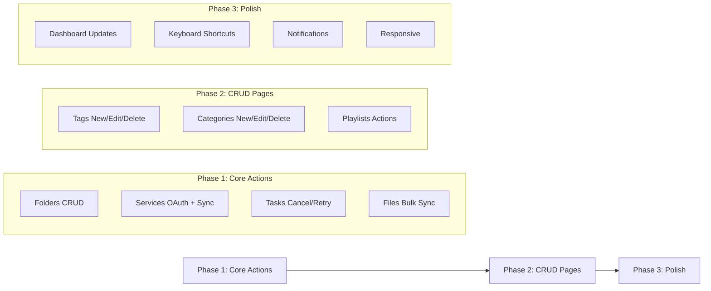

# Frontend Next — Interactive Wiring Plan

## Current State

All 11 pages load real data from the backend API but lack interactive features (buttons, forms, modals, OAuth flows). Each page below shows what's working vs what's stubbed.

### Wiring Status Overview

| Page | Data Load | Event Wiring | API Mutations |
|------|-----------|--------------|---------------|
| Dashboard | ✅ | ✅ (links) | N/A (read-only) |
| Files | ✅ | ✅ (search/filter/paginate) | ❌ edit/view/bulk-sync are `console.log` |
| Tracks | ✅ | ✅ (search/filter/paginate/refresh) | N/A (read-only) |
| Playlists | ✅ | ✅ (search/filter/paginate/select) | ❌ create-tag/edit-tag/sync are `console.log` |
| Tags | ✅ | ✅ (filter/search) | ❌ new/edit/delete are `alert()` |
| Tag Categories | ✅ | ✅ (stub actions) | ❌ new/edit/delete are `alert()` |
| Services | ✅ | ❌ no event wiring | ❌ configure/auth/resync are `console.log` |
| Folders | ✅ | ❌ no event wiring | ❌ add/edit/delete/scan/watch not wired |
| Tasks | ✅ | ✅ (filter/refresh) | ❌ cancel/logs/retry are `alert()` |
| Auto-Categorize | ✅ | ✅ full wizard | ✅ working |
| Bulk Import | ✅ | ✅ full flow | ✅ working |

---

## Implementation Priority

### Tier 1 — Critical (real API mutations)

#### 1. Folders — Full CRUD + Actions

**Files:** `frontend_next/pages/folders.js`

**Backend endpoints available:**
- `POST /api/folders` — Add folder (body: `AddFolderRequest`)
- `PUT /api/folders/{id}` — Update folder (body: `UpdateFolderRequest`)
- `DELETE /api/folders/{id}` — Delete folder
- `POST /api/folders/{id}/scan` — Trigger scan
- `POST /api/folders/{id}/watch` — Toggle watch

**AddFolderRequest shape:**
```json
{
  "path": "/path/to/music",
  "watchEnabled": true,
  "scanRecursive": true,
  "fixedExtensions": true,
  "fileExtensions": "mp3,flac,wav",
  "maxDepth": 10
}
```

**What to build:**
- [ ] **Add Folder modal** — Triggered by "Add Folder" button
  - Path input (required)
  - Watch toggle (checkbox)
  - Recursive scan toggle (checkbox)
  - Fixed extensions toggle (checkbox) → shows extension checkboxes
  - Save/Cancel buttons
  - POST to `/api/folders`
- [ ] **Edit Folder modal** — Same form, pre-populated, PUT to `/api/folders/{id}`
- [ ] **Delete folder** — Confirm dialog → DELETE `/api/folders/{id}` → reload
- [ ] **Scan folder** — POST `/api/folders/{id}/scan` → show success → reload after delay
- [ ] **Toggle watch** — POST `/api/folders/{id}/watch` → toggle icon → reload
- [ ] **Search** — Wire search input (client-side or pass as query param)
- [ ] **Error handling** — showError banner for all mutations

#### 2. Services — OAuth + Sync + Config

**Files:** `frontend_next/pages/services.js`

**Backend endpoints available:**
- `POST /api/services/{service}/auth` — Start OAuth (returns redirect URL)
- `POST /api/services/{service}/reset` — Reset connection
- `POST /api/services/{service}/sync` — Trigger sync
- `GET /api/services/{service}/config` — Get config
- `PUT /api/services/{service}/config` — Save config
- `GET /api/services/{service}/fetch-counts` — Fetch remote counts
- `GET /api/services/{service}/sync-status` — Get sync status

**What to build:**
- [ ] **Authorize button** → POST `/api/services/{service}/auth` → redirect to returned URL
- [ ] **Configure button** → Open modal with service-specific fields
  - Spotify: show redirect URI, env status
  - SoundCloud: userId input
  - YouTube: playlistId input
- [ ] **Save Config** → PUT `/api/services/{service}/config`
- [ ] **Resync button** → POST `/api/services/{service}/sync` → show task started
- [ ] **Fetch Counts** → GET `/api/services/{service}/fetch-counts` → reload
- [ ] **Reset Connection** → POST `/api/services/{service}/reset` → confirm → reload
- [ ] **Refresh All** → Reload all services

#### 3. Tasks — Cancel/Retry/Logs

**Files:** `frontend_next/pages/tasks.js`

**Backend endpoints:**
- `POST /api/tasks/{id}/cancel` (or `DELETE /api/tasks/{id}`)
- `GET /api/tasks?limit=&offset=&status=` — Reload with status filter

**What to build:**
- [ ] **Cancel task** → DELETE `/api/tasks/{id}` → confirm → reload
- [ ] **Retry failed task** → Re-trigger the operation
- [ ] **View logs** → Show inline or modal with task details
- [ ] **Task polling** → Auto-refresh every 2-3s when any task is running

#### 4. Files — Bulk Sync + Comment Write

**Files:** `frontend_next/pages/files.js`

**Backend endpoints:**
- `POST /api/files/{id}/write-comment` — Write comment to file
- `POST /api/files/bulk-write-comments` — Bulk write all pending comments

**What to build:**
- [ ] **Bulk Sync button** → POST to bulk write endpoint → show task progress
- [ ] **Edit file** → Open quick-edit modal for comment/tags
- [ ] **View file** → Show file details modal
- [ ] **Write single comment** → If commentNeedsUpdate, show "Write" action per row

---

### Tier 2 — Important (CRUD operations)

#### 5. Tags — New/Edit/Delete

**Files:** `frontend_next/pages/tags.js`

**Backend endpoints:**
- `POST /api/tags` — Create tag
- `PUT /api/tags/{id}` — Update tag (rename, change category)
- `DELETE /api/tags/{id}` — Delete tag

**What to build:**
- [ ] **New Tag modal** — Name + category selector → POST `/api/tags`
- [ ] **Edit Tag modal** — Pre-populated name/category → PUT `/api/tags/{id}`
- [ ] **Delete Tag** — Confirm → DELETE `/api/tags/{id}` → reload

#### 6. Tag Categories — New/Edit/Delete

**Files:** `frontend_next/pages/tag-categories.js`

**Backend endpoints:**
- `POST /api/tag-categories` — Create category
- `PUT /api/tag-categories/{id}` — Update category
- `DELETE /api/tag-categories/{id}` — Delete category

**What to build:**
- [ ] **New Category modal** — Name + prefix + icon + sort order
- [ ] **Edit Category modal** — Pre-populated
- [ ] **Delete Category** — Confirm (disabled for default) → DELETE

#### 7. Playlists — Create Tag + Sync

**Files:** `frontend_next/pages/playlists.js`

**Backend endpoints:**
- `POST /api/playlists/{id}/sync` — Sync single playlist
- `POST /api/tags` — Create tag from playlist name

**What to build:**
- [ ] **Create Tag button** → POST `/api/tags` with playlist name → reload
- [ ] **Sync Playlist** → Trigger sync for that playlist
- [ ] **Bulk Create Tags** → For all selected untagged playlists
- [ ] **Keyboard shortcut** — Ctrl+F for search focus

---

### Tier 3 — Enhancement (polish)

#### 8. Dashboard — Live Updates

**Files:** `frontend_next/pages/dashboard.js`

- [ ] **Service cards clickable** — Click to navigate to services page
- [ ] **Task polling** — Auto-refresh tasks section if any running
- [ ] **Re-sync buttons** — Quick sync action on service cards

#### 9. Cross-Cutting

- [ ] **Global error banner** — Reusable toast/notification component in `shared/components.js`
- [ ] **Keyboard shortcuts** — Ctrl+F search focus, Escape clear/close, arrow pagination
- [ ] **Mobile responsive** — Verify sidebar collapse, table scroll, modal sizing
- [ ] **Loading states** — Button loading spinners during API calls (disable button, show spinner)
- [ ] **Confirm dialogs** — Consistent confirm pattern for destructive actions (delete, reset)

---

## Implementation Order



---

## Implementation Patterns

### Pattern 1: Folder CRUD (modal + mutations)

```javascript
// folders.js — Step-by-step recipe

// 1. Add state
const state = {
  folders: [],
  editingFolder: null,
  showModal: false,
};

// 2. Add modal HTML render
function renderAddFolderModal(folder) {
  /* Returns HTML for modal overlay with form fields */
}

// 3. Add event wiring in render function
function wireEvents(container, signal) {
  // "Add Folder" button
  container.querySelector('[data-action="add-folder"]')
    .addEventListener('click', () => openModal(null));

  // Event delegation for row actions
  container.addEventListener('click', (e) => {
    const btn = e.target.closest('[data-action]');
    if (!btn) return;
    const { action, id } = btn.dataset;
    if (action === 'remove') deleteFolder(id);
    if (action === 'rescan') scanFolder(id);
    if (action === 'toggle-watch') toggleWatch(id);
  });

  // Modal save
  container.querySelector('#folder-save-btn')
    .addEventListener('click', async () => {
      const data = collectFolderForm(container);
      if (state.editingFolder) {
        await fetchJSON(`/api/folders/${state.editingFolder.id}`, {
          method: 'PUT', body: JSON.stringify(data)
        });
      } else {
        await fetchJSON('/api/folders', {
          method: 'POST', body: JSON.stringify(data)
        });
      }
      closeModal();
      init(container, signal); // Reload
    });
}
```

### Pattern 2: Services OAuth flow

```javascript
// Services — Authorize button handler

async function authorizeService(service, btn) {
  btn.disabled = true;
  btn.innerHTML = '<i class="fas fa-spinner fa-spin"></i> Connecting...';

  try {
    const resp = await fetchJSON(`/api/services/${service}/auth`, {
      method: 'POST'
    });
    // resp.data contains the redirect URL
    window.location.href = resp.data;
  } catch (err) {
    // Show error toast, re-enable button
    btn.disabled = false;
    btn.innerHTML = originalHTML;
    showError(`Auth failed: ${err.message}`);
  }
}
```

### Pattern 3: Shared modal component

Add a reusable modal helper to `shared/components.js`:

```javascript
export function renderModal({ id, title, bodyHtml, footerHtml, onClose }) {
  // Returns modal overlay HTML
  // Sets up close button + outside-click-to-close
  // Returns cleanup function
}

export function useModal(container) {
  // Returns { open, close, setContent } helpers
}
```

---

## API Reference (mutation endpoints)

| Endpoint | Method | Purpose | Request Body |
|----------|--------|---------|-------------|
| `/api/folders` | POST | Add folder | `AddFolderRequest` |
| `/api/folders/{id}` | PUT | Update folder | `UpdateFolderRequest` |
| `/api/folders/{id}` | DELETE | Delete folder | — |
| `/api/folders/{id}/scan` | POST | Scan folder | — |
| `/api/folders/{id}/watch` | POST | Toggle watch | — |
| `/api/services/{svc}/auth` | POST | OAuth start | — |
| `/api/services/{svc}/reset` | POST | Reset connection | — |
| `/api/services/{svc}/sync` | POST | Trigger sync | — |
| `/api/services/{svc}/config` | GET | Get config | — |
| `/api/services/{svc}/config` | PUT | Save config | `{ userId?, playlistId? }` |
| `/api/services/{svc}/fetch-counts` | GET | Fetch counts | — |
| `/api/services/{svc}/sync-status` | GET | Sync status | — |
| `/api/tags` | POST | Create tag | `{ name, categoryId }` |
| `/api/tags/{id}` | PUT | Update tag | `{ name?, categoryId? }` |
| `/api/tags/{id}` | DELETE | Delete tag | — |
| `/api/tag-categories` | POST | Create category | `{ name, prefix?, icon?, sortOrder? }` |
| `/api/tag-categories/{id}` | PUT | Update category | — |
| `/api/tag-categories/{id}` | DELETE | Delete category | — |
| `/api/tasks/{id}` | DELETE | Cancel task | — |

---

## Files that need changes

| File | Changes Needed |
|------|---------------|
| `frontend_next/pages/folders.js` | **Complete rewrite** — add modals, CRUD API calls, scan/watch events |
| `frontend_next/pages/services.js` | **Rewrite event section** — real API calls for auth/config/sync/reset |
| `frontend_next/pages/tasks.js` | Wire cancel/retry/logs with real API calls |
| `frontend_next/pages/files.js` | Wire edit/view/bulk-sync with real modal + API |
| `frontend_next/pages/playlists.js` | Wire create-tag/edit-tag/sync with real API |
| `frontend_next/pages/tags.js` | Wire new/edit/delete with real API calls + modals |
| `frontend_next/pages/tag-categories.js` | Wire new/edit/delete with real API calls + modals |
| `frontend_next/pages/dashboard.js` | Add service card click targets, task polling |
| `frontend_next/shared/components.js` | Add `renderModal`, `useModal`, `showToast` helpers |
| `frontend_next/shared/api.js` | (no changes needed, already complete) |

---

## Testing Checklist

Before marking this plan complete, verify:

- [ ] `cargo build` succeeds (no backend changes needed)
- [ ] `cargo run -- serve` starts on port 3000
- [ ] Each mutation hits the correct endpoint with correct body
- [ ] Error states show a user-friendly banner (not a blank page)
- [ ] Button shows loading state during API calls
- [ ] Successfully created/updated items appear after reload
- [ ] Delete operations show confirmation dialog
- [ ] OAuth flow redirects to Spotify auth page
- [ ] Task cancel/retry updates the task list
