# 01 · Ist-Zustand — die App heute

> UI/UX-Redesign-Proposal für momo's music manager · Branch `proposal/ui-ux-redesign`
> Alle Screenshots: Dark-Theme, Desktop-Viewport **1440×900** (Retina-Faktor 2, full-page).
> Wie die Screenshots entstanden sind → [Methodik](#wie-die-screenshots-entstanden-sind).

## Die App in einem Absatz

momo's music manager ist ein **Rust-Server mit eingebetteter Web-UI** (kein separater Dev-Server; die UI wird als statisches Asset ausgeliefert). Das Frontend ist eine **SPA mit Hash-Router** (`frontend/app.js`, 26 Views à `frontend/pages/<id>.js`) — jede View ist direkt per URL erreichbar (`/#deemix-queue`, `/#files?commentStatuses=needs_update`). Dazu existiert ein Tauri-Tray-Client (`src/tray.rs`, `src/power.rs`), der die App im Hintergrund hält — die Web-UI ist aber der Hauptarbeitsplatz.

**App-Chrome:** Top-Navigation statt Sidebar (`shared/nav.js`) mit vier Gruppen — **Overview** (Dashboard), **Library** (Files, Tracks, Playlists, Tags, Tag Categories), **Services** (Services, Tasks, Folders, Deemix Queue, Traktor Import), **System** (Settings) — plus ein **Tools-Dropdown** mit zehn weiteren Views (Tag Curation, Auto-Categorize, Digging Curator, Import/Export, Key Comparison, Storage, Backpack, Daily, Tag Bundles, Dynamic Bundles).

**Design-Tokens** (`frontend/style.css` `:root`): dunkles Theme, `--bg #0b0d12`, `--surface #14181f`, `--accent #6366f1` (Indigo), Akzentfarben für Status (`--green`, `--red`, `--yellow`, `--purple`, `--pink`, `--orange`), Radien 4–12 px, system-ui-Stack. Solide Basis — die Reibung liegt in Dichte, Auffindbarkeit und fehlenden Zwischenzuständen (Details in [02-ux-reibungsanalyse.md](02-ux-reibungsanalyse.md)).

---

## F1 · Download-Queue (Deemix)

**Views:** `/#deemix-queue` (Services ▸ Deemix Queue). Tabelle mit 12 Spalten (Status, Title, Artist, Playlist, URL, Progress, Total, Downloaded, Detail, Created/Updated, Actions), Status-Filter (All/Queued/Downloading/Completed/Failed), Polling auf `/api/services/deemix/queue`.

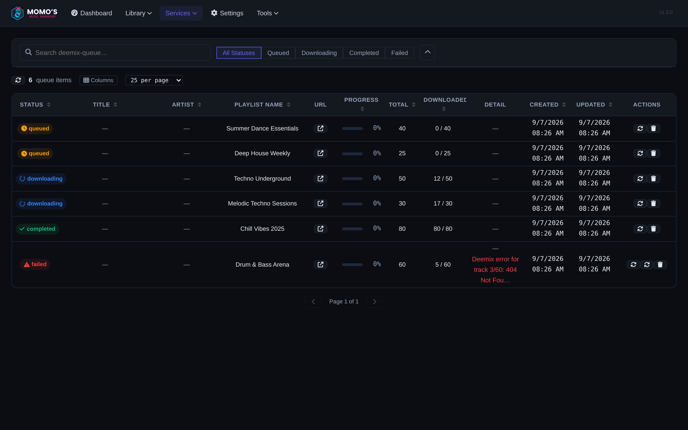

**Beobachtungen**

- Status ist als farbige Badges umgesetzt (Orange = queued, Blau mit Spinner = downloading, Grün = completed, Rot = failed) — die einzige Status-Visualisierung.
- **Title/Artist sind „—“**, solange kein Deemix-Server verbunden ist (die Queue lebt dann nur von `playlist_name` + Counts). Zwei Breiten-Spalten zeigen dann nur Platzhalter.
- Die Spalte **Progress zeigt 0 %**, obwohl z. B. `12 / 50` heruntergeladen sind: Der Prozentwert kommt nur aus Live-Task-Events des Deemix-Servers; die statischen `downloaded/total`-Counts korrelieren nicht mit der Anzeige. Zwei Fortschritts-Metaphern (Zahl vs. Prozent) erzählen unterschiedliche Geschichten.
- Fehlerdetails (`Detail`) sind roher Text in der Zeile und sprengen bei langen Meldungen das Zeilenlayout.
- Header-Label „Downloaded“ läuft im Spaltenkopf um; die Tabelle ist bei 1440 px am Limit.

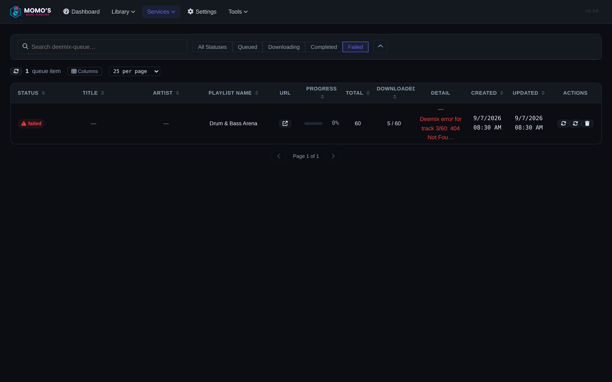

- Filter & Suche sind im einklappbaren Filterpanel oben (Konsistenz zur Files-Seite); die gefilterte Ansicht zeigt Retry-/Delete-Aktionen pro Zeile.
- Aktionen sind reine Icon-Buttons (Retry, Delete) ohne Label; es gibt keine Bulk-Aktion („alle Failed retrien“), keine Status-Gruppierung, keine Zusammenfassung („3 Downloads aktiv, 1 Fehler“).

---

## F2 · Tag-Kommentar / PMV-Roundtrip

**Views:** `/#files` mit Kommentar-Filter, `/#file-detail?id=`, Kontext `/#digging`, `/#tags`, `/#tag-categories`. Das System dahinter (siehe `docs/COMMENT_SYSTEM.md`): Ein „Comment Target“ (z. B. `[_M_] groovy sp:spotify:track:…`) beschreibt den gewünschten PMV-Kommentar; weicht der echte Datei-Kommentar ab (`commentNeedsUpdate`), gilt die Datei als **Needs Update**.

### Files-Liste mit Diff

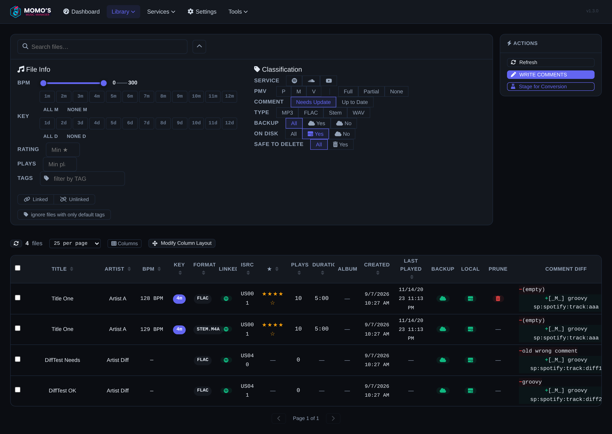

Der Screen zeigt 4 lokale Dateien mit Needs-Update-Status. Pro Datei malt die Spalte **Comment Diff** den Vergleich inline in die Tabelle: rote Zeile „− alt“, grüne Zeile „+ neu“, dazu pro Zeile ein Stift-Button („Write comment to file“). Rechts die Sidebar mit **Refresh / WRITE COMMENTS / Stage for Conversion**.

**Beobachtungen**

- Der Diff ist **maschinenlesbar formuliert** (`[_M_] groovy sp:spotify:track:diff1`) — kein Klartext, keine Legende, was `[_M_]`, Kategorien oder die Spotify-Referenz bedeuten.
- Zwei Diff-Zeilen pro Datei blähen die Tabellenzeilen auf; zusammen mit 15+ Spalten (BPM/Key/Rating/PMV-Filter, TYPE, Local, Prune …) ist der Screen dicht.
- „Write“ existiert **dreimal** mit unterschiedlicher Granularität: Stift pro Zeile, „WRITE COMMENTS“ (Sidebar, alle), „Write Comments“ (Dashboard-Karte) — aber kein Schritt „Diff einzeln reviewen & anwenden“ dazwischen.
- Die Spalte mischt Typen: Bei Nicht-Local-Dateien erscheint statt des Diffs Text wie „Backup only“ — eine Spalte, drei Semantiken.

### File-Detail

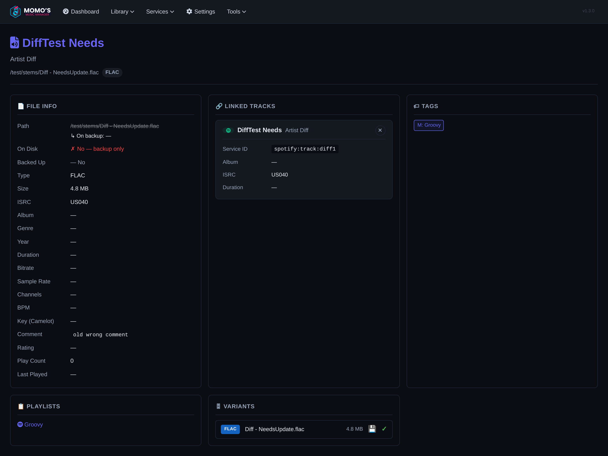

Detailseite mit File Info, Linked Tracks, Tags, Playlists & Variants. Viele Metadaten-Felder sind „—“ (Genre, Year, BPM …), der On-Disk-Status leuchtet **rot („✗ No“)**, obwohl die Datei in „Variants“ als vorhanden geführt wird — Alarmfarbe ohne Alarm.

### Digging Curator

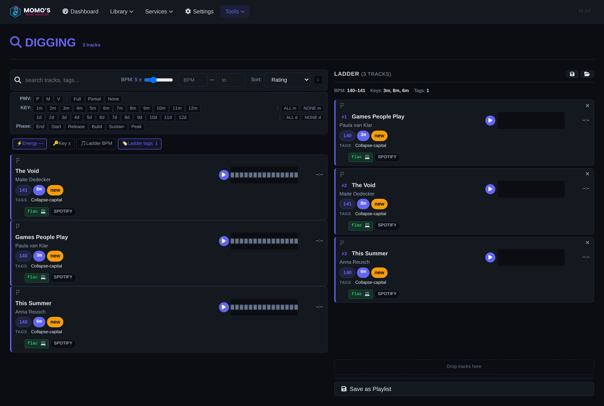

Der Digging-Screen (Tools ▸ Digging Curator) ist ein **Zwei-Pane-Browser**: links Track-Karten (Play, Wellenform-Platzhalter, Tags, Service-/Dateityp-Icons), rechts die **Ladder** (Set-Aufbau). Track-Karten werden per **Drag & Drop** (Griff-Icon ⠟) in die Ladder gezogen; aus der Ladder leiten sich Filter-Chips ab (Energy, Key ±, Ladder BPM, Ladder tags). Oben BPM-/Key-Filter, Ladder-Session speichern/laden.

**Beobachtungen**

- Die „Wellenform“ in den Karten ist ein **statisches graues Blockmuster** — Platzhalter, kein Signal.
- Drag & Drop ist der **einzige** Weg in die Ladder (kein „+“-Button, kein Doppelklick) — per Maus ok, aber nicht entdeckbar/barrierefrei; Track-Karten haben sonst keine sichtbare Interaktions-Affordanz.
- Der Ladder-Bereich wirkt trotz Inhalt unten offen („Drop tracks here“-Zone bleibt prominent).
- Digging liegt unter dem Tools-Dropdown — für ein Werkzeug, das Momo häufiger nutzen will, zwei Klicks tief.

---

## F3 · Files / Tracks-Browse

**Views:** `/#files`, `/#tracks`, `/#file-detail?id=`, `/#track-detail?id=`, `/#folders`, `/#folder-detail?id=`.

### Files (ungefiltert)

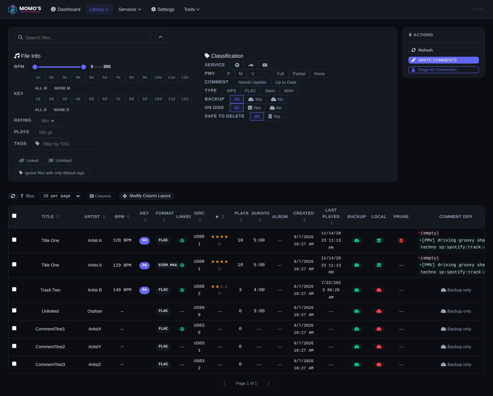

Der Standard-Library-Screen: oben das (aufgeklappte) Filterpanel mit BPM-Slider, Camelot-Key-Grid, Rating, Service-/Type-/Backup-/Comment-/Local-Chips; darunter die Tabelle mit Server-Side-Sortierung/Pagination; rechts Sidebar-Aktionen.

**Beobachtungen**

- Der Filterkopf ist **sehr hoch** (zwei Spalten voller Controls) und standardmäßig offen — er konkurriert mit der Tabelle um den ersten Screen.
- „Comment Diff“-Spalte wie in F2; unten (nicht-lokale Dateien) wieder Text statt Diff.
- „Last Played“-Daten brechen in der schmalen Spalte um; Prune-Icons sind rot ohne Label.

### Tracks

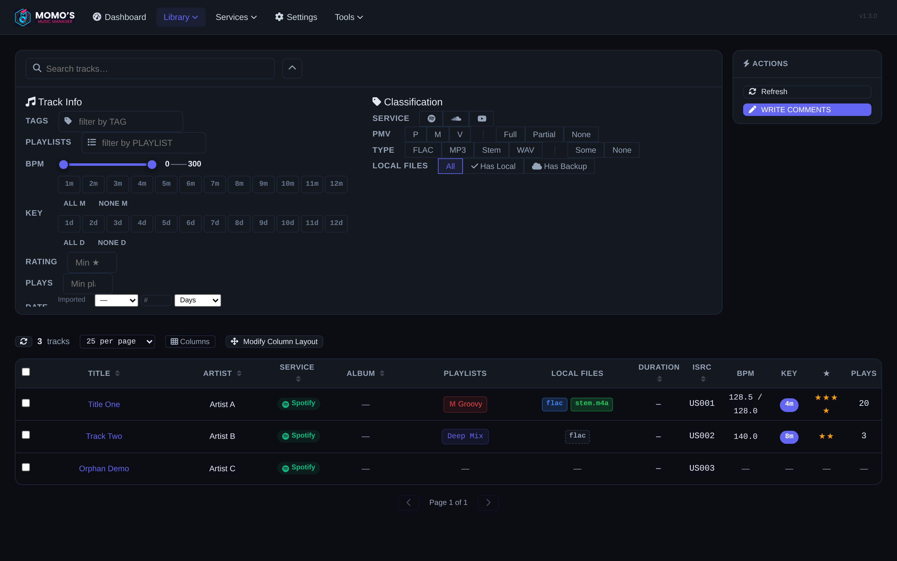

Service-Tracks (Spotify) mit Link-Status zu lokalen Files. Spalten: Checkbox, Title, Artist, Service, Album, Playlists, Local Files, Duration, ISRC, BPM, Key, Rating, Plays + umfangreiche Filterleiste links (Tags, Playlists, BPM, Key-Grid, Rating).

**Beobachtungen**

- „Duration“ ist durchgehend „—“; „Service“ nur Icon; „Local Files“-Badges mischen Formate (`flac`, `stem.m4a`).
- Zwei Filter-Mechaniken auf einer Seite (Filterpanel oben in Files vs. Filter-Sidebar in Tracks) — Muster-Drift zwischen den CRUD-Seiten.

### File-Detail mit WAV-Varianten

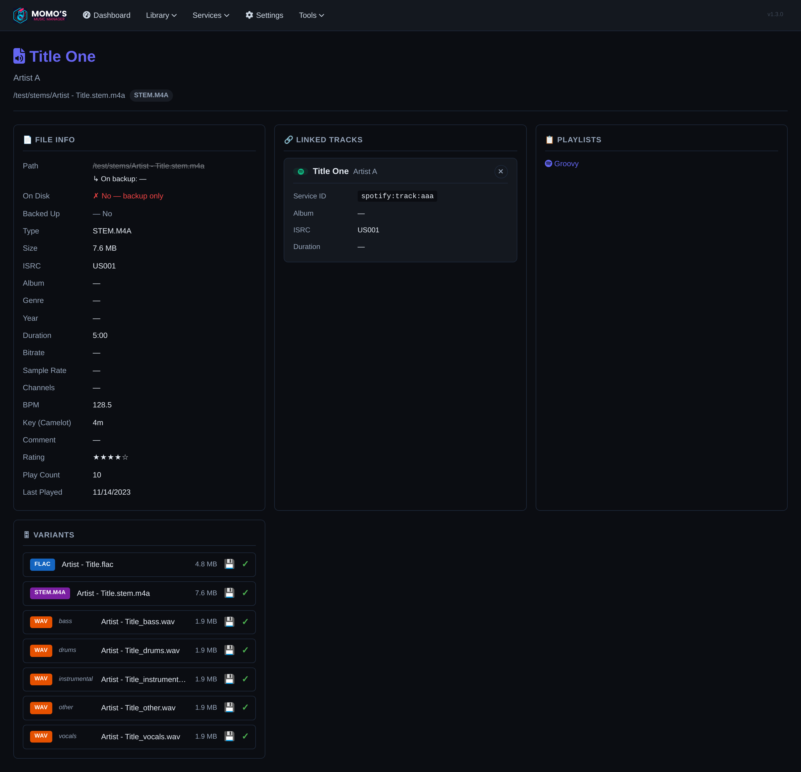

Zeigt die Stamm-Datei (`Artist - Title.stem.m4a`) als Quelle von **5 WAV-Varianten** (vocals/bass/drums/instrumental/other, je 1,9 MB, grüner Haken „vorhanden“) — der Consistency-Kontext fürs Track-Management.

---

## F4 · Traktor-Import / Consistency

**Views:** `/#traktor-import` (Services ▸ Traktor Import), Ergebnis via `/#tasks`.

### Leerzustand (Auto-Detect ohne collection.nml)

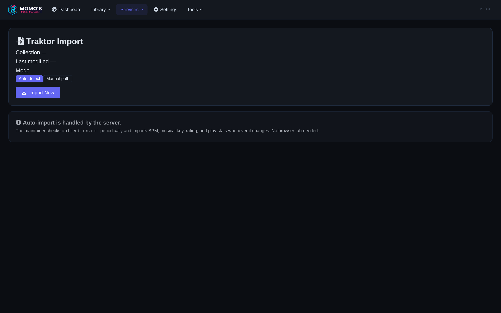

Statuszeilen zeigen **„Collection —“ / „Last modified —“**, Modus-Toggle Auto-detect/Manual path, großer „Import Now“-Button, darunter eine Erklär-Karte (Auto-Import läuft serverseitig, prüft collection.nml periodisch).

### Manueller Modus

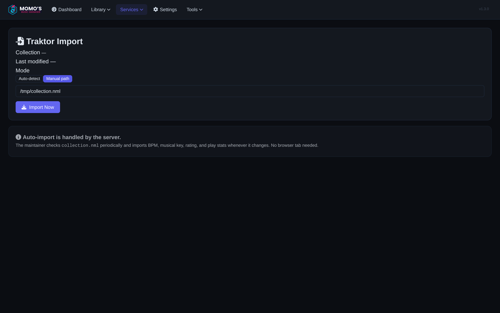

Im Manual-Modus erscheint ein Pfad-Feld. **Wichtig (Friction-Fund aus dem Testlauf):** Der Pfad wird **nur mit Enter übernommen** — kein sichtbarer Speichern-Button, kein Browse-Dialog, kein Hinweis auf den Save-Trigger. Wer tippt und wegklickt, importiert still den alten/leeren Pfad.

### Nach erfolgreichem Import

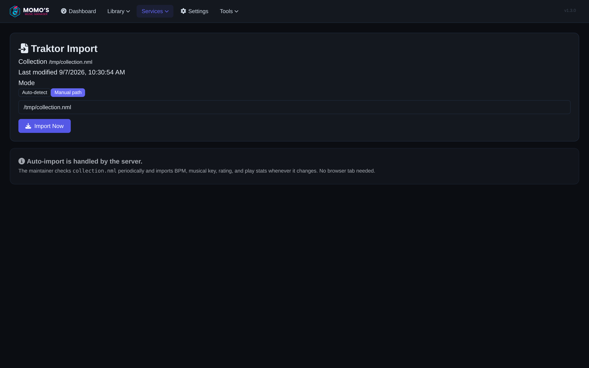

Die Statuszeilen sind gefüllt (Pfad `/tmp/collection.nml`, Last modified). **Das Import-Ergebnis selbst erscheint nicht auf dieser Seite** — es wandert in die Tasks.

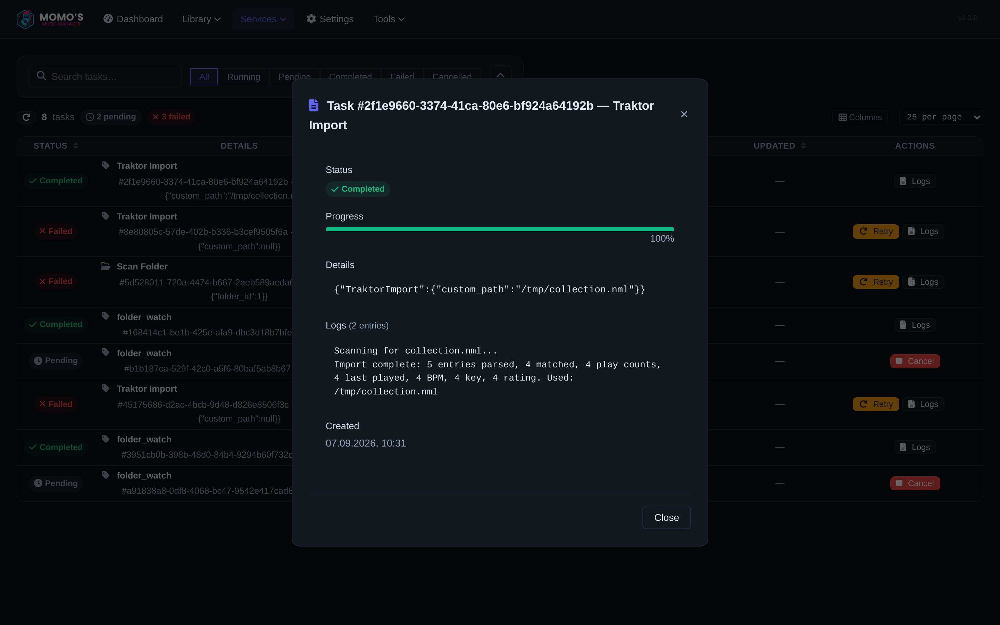

Das Task-Log (Detail-Modal aus der Tasks-Tabelle) zeigt die echten Zahlen: **5 entries parsed, 4 matched**, übernommen wurden 4× play count / last played / BPM / Key / Rating. Diese Information ist der einzige „Was hat der Import gemacht?“-Moment der App.

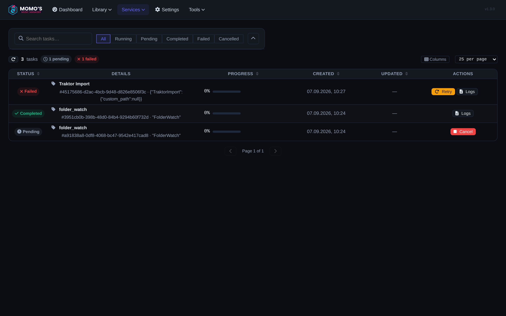

Die Tasks-Liste offenbart die zweite Reibung: Ein **fehlgeschlagener Auto-Import** („Import Now“ ohne gefundene collection.nml) erscheint als Failed-Zeile, deren Argument als **rohes JSON** in der Zelle steht (`{"custom_path":null}`) — Status „Failed“ + 0 %-Balken auch bei Completed-Tasks. Der Fehlschlag-Pfad erklärt dem Nutzer nicht, was er tun soll (Pfad manuell setzen!).

---

## Kontext-Screens

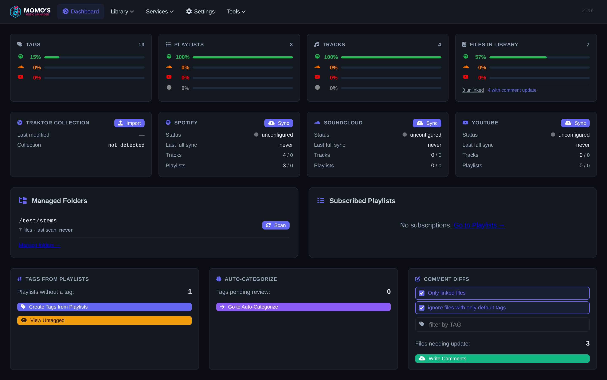

Dashboard mit Statistik-Reihe (Tags-Abdeckung 15 %, Playlists, Tracks, Files 57 % + 3 ungelinkte), Service-Status (Traktor: not detected; Spotify/Soundcloud/YouTube: unconfigured), Managed Folders, Subscribed Playlists, Tags-from-Playlists, Auto-Categorize und **Comment Diffs**-Karte (3 Dateien brauchen ein Update, „Write Comments“-Button).

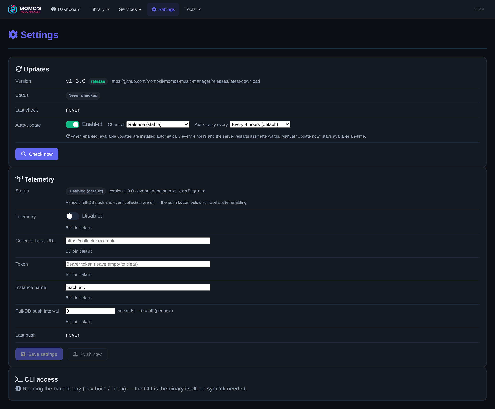

Settings mit drei Karten: **Updates** (v1.3.0, Never checked, Auto-Update aktiv), **Telemetry** (Disabled default, Collector-URL/Token/Instanzname/Push-Intervalle) und **CLI access** — für die Roadmap der wichtigste Ankerpunkt zum Thema Telemetry.

---

## Wie die Screenshots entstanden sind

Reproduzierbar mit dem Playwright-Setup des Repos (`frontend/playwright.config.js`):

1. **Server** (Repo-Root, cwd wichtig — die SQLite-Datei liegt relativ):
   `DATABASE_URL=sqlite:test-playwright.db cargo run -- serve --no-autoupdate --host 127.0.0.1 --port 3001`
   (`--no-autoupdate` ist Pflicht, damit der Autoupdater nicht in dieselbe DB schreibt.)
2. **Test-Daten** über den immer aktiven Testing-Endpoint: `POST /api/testing/seed {"scenario":"…"}` mit `basic`, `comment_diff`, `digging`, `wav_variants`, `files_filter` (Seed leert alle Tabellen; ein Seed = ein Zustand).
3. **Deemix-Queue** hat kein Seed-Szenario → direkte `sqlite3`-INSERTs in `deemix_downloads` (6 Playlists, gemischte Stati inkl. Fehlermeldung), **nach** dem letzten Seed.
4. **Traktor**: selbst erstellte `collection.nml` unter `/tmp` (5 Entries, Mac-Colon-Pfade, PLAYCOUNT/RANKING/KEY/TEMPO) + Import über die UI (Manual path → Enter → „Import Now“); Task-Ergebnis in-memory, Screenshot zügig danach.
5. **Capture**: Chromium (Playwright 1.60.0), Viewport 1440×900, `deviceScaleFactor: 2`, full-page PNG nach `docs/ui-ux/screenshots/`. Kein Capture-Skript ist eingecheckt — die App selbst blieb unverändert (nur Docs/Mockups/Screenshots im PR).

**Weiter:** [02 · UX-Reibungsanalyse](02-ux-reibungsanalyse.md) · [03 · Redesign-Mockups](03-redesign-mockups.md) · [04 · Roadmap](04-roadmap.md) · [Start](README.md)
