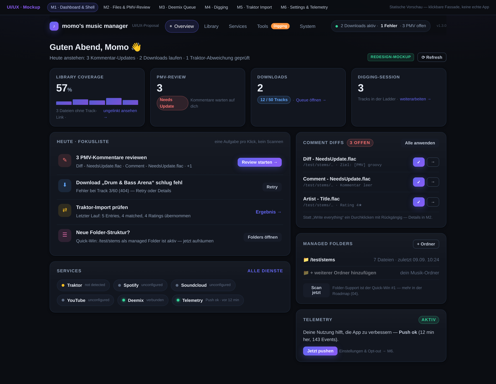
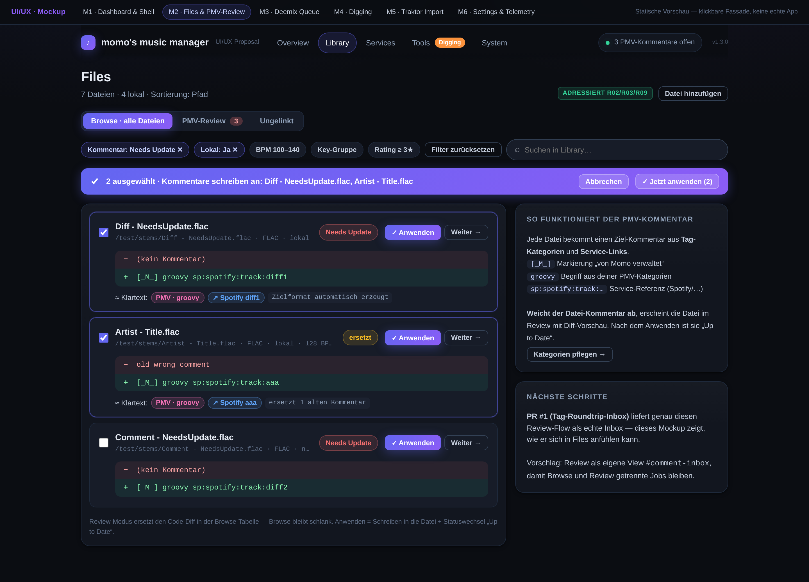
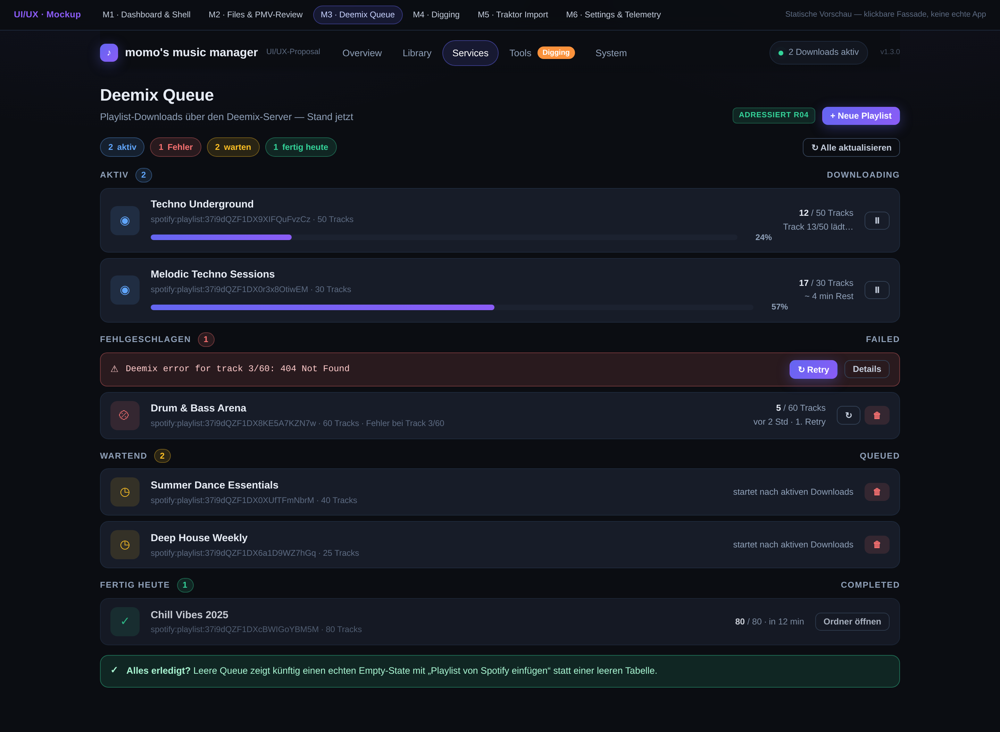
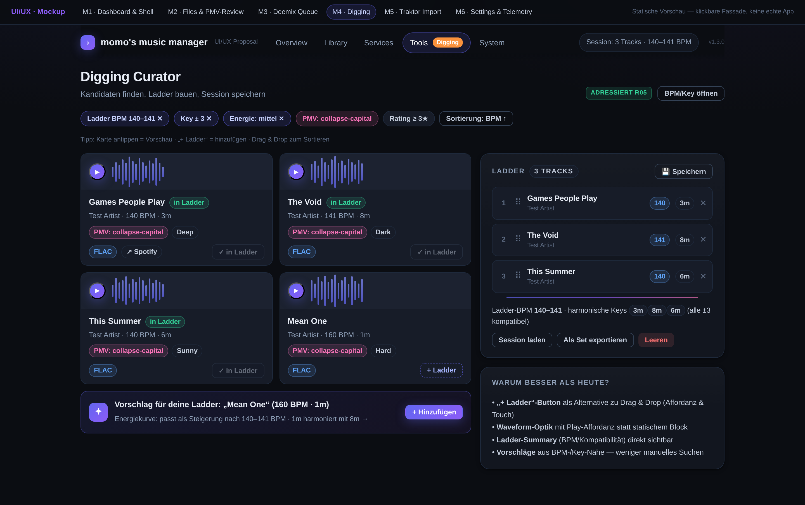
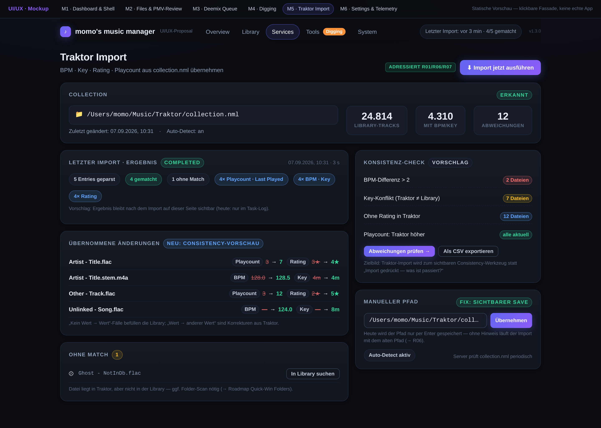
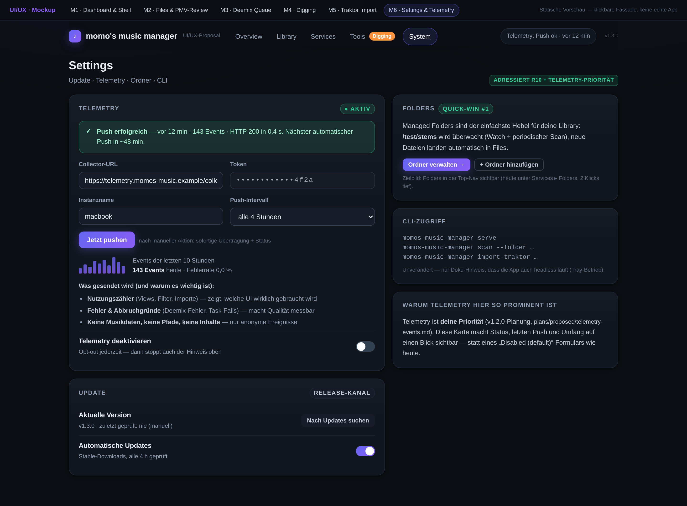

# 03 · Redesign-Mockups

> Sechs **klickbare HTML-Mockups** unter [`mockups/`](mockups/) (statische Fassade — kein App-Code, nur Doku).
> Jedes Mockup adressiert konkrete Befunde aus [02-ux-reibungsanalyse.md](02-ux-reibungsanalyse.md) (IDs R01–R11).
> Die PNGs darunter sind die gerenderten Vorschauen (GitHub rendert HTML nicht interaktiv — die Screenshots sind der Blick in die Mockups; die HTML-Dateien zum Durchklicken lokal öffnen).

**Design-Entscheidungen (für alle Mockups):**

- **Tokens bleiben die der echten App** (`style.css` `:root`: `#0b0d12`-Background, `#6366f1`-Akzent …) — das Redesign will **veredeln, nicht neu erfinden**: Verlauf statt Flachfarbe auf Primaries, weiche Schatten, größere Radien (12–16 px), Fokus-Ringe, Micro-Interactions (Hover-Lift, Press-Scale).
- **Status wird Zustand:** Fortschritt nur noch als Balken mit % + Zähler, Fehler als eigene Zeile statt Roh-Text in der Tabelle.
- **Eine Aufgabe pro Screen:** Browse- und Review-Modi werden getrennt statt in einer Megatabelle vermischt.
- **Globaler Aktivitäts-Streifen** in der Top-Nav (Downloads/PMV/Import) — der „was passiert gerade“-Blick fehlt heute (R10).

---

## M1 · Shell & Dashboard — „Was ist heute zu tun?“

**Klickbar:** [mockup-shell-dashboard.html](mockups/mockup-shell-dashboard.html)

| | |
|---|---|
| **Adressierte Friction** | R10 (30 Views, kein Fokus), Dashboard ohne Handlungsbezug |
| **Kern-Idee** | Dashboard wird zur **Fokusliste**: „Heute“-Karte mit den 3–4 echten nächsten Schritten (PMV-Review 3, Download-Fehler, Traktor-Ergebnis, Folder-Cleanup) — jede Zeile mit direktem Sprungziel. Statistik-Karten bekommen Kontext-Füße („3 ungelinkt ansehen →“) statt nackter Zahlen. |
| **Shell** | Aktive Sektion als Pill mit Akzent; **Tools-Ziele (Digging) als sichtbarer Badge-Eintrag** statt komplett im Dropdown; globaler Aktivitäts-Chip rechts; Comment-Diffs-Karte mit **Durchklicken** (✓ / überspringen) statt „Alles schreiben“. |
| **Aufwand** | S (Shell/Token) + M (Dashboard-Umbau) |

---

## M2 · Files & PMV-Review — „Diff verstehen, einzeln anwenden“

**Klickbar:** [mockup-files-commentdiff.html](mockups/mockup-files-commentdiff.html)

| | |
|---|---|
| **Adressierte Friction** | R02 (Code-Diff unlesbar), R03 (3 Write-Orte, kein Bulk-Review), R09 (Filterwust) |
| **Kern-Idee** | View-Segmente **Browse / PMV-Review / Ungelinkt** trennen die Jobs. Review-Modus: pro Datei eine Karte mit **lesbarem Diff** (rot „− alt“ / grün „+ neu“) plus **Klartext-Übersetzung** (`PMV · groovy`, `↗ Spotify diff1`) — das Zielformat wird erklärt statt vorausgesetzt. |
| **Anwenden** | ✓ pro Zeile, „Weiter →“ zum Überspringen, **Bulk-Bar** (sticky) für „die 2 gewählten jetzt schreiben“. Damit ist der „Review dann Write“-Schritt da, den die Sidebar-„WRITE COMMENTS“ heute überspringt. |
| **Legende** | Rechts erklärt die PMV-Syntax (`[_M_]`, Kategorien, Service-Links) — heute versteckt in `docs/COMMENT_SYSTEM.md`. |
| **Bezug** | **PR #1 (Tag-Roundtrip-Inbox)** baut genau diesen Review-Flow als echte Inbox; Mockup zeigt, wie er sich in die Files-Navigation einfügt (Vorschlag: eigene View `#comment-inbox`). |
| **Aufwand** | M (Review-Modus + Diff-Rendering) — teilweise durch PR #1 vorbahnt |

---

## M3 · Deemix Queue — „Status auf einen Blick“

**Klickbar:** [mockup-deemix-queue.html](mockups/mockup-deemix-queue.html)

| | |
|---|---|
| **Adressierte Friction** | R04 (Progress 0 % vs. Counts, roher Fehlertext, 12 Spalten) |
| **Kern-Idee** | Statt Tabelle: **Gruppierung nach Status** (Aktiv / Fehlgeschlagen / Wartend / Fertig) mit Summary-Chips oben („2 aktiv · 1 Fehler · 2 warten · 1 fertig“). Jede Zeile ist eine Karte: Playlist-Name, URL, **Progress-Balken mit % und ETA**, Download-Zähler konsistent zur Zahl. |
| **Fehler** | Eigene rote Fehler-Zeile mit Meldung + **Retry/Details**-Buttons — kein Zeilen-Sprenger mehr. |
| **Extras** | Pause-Button für laufende Downloads, „Ordner öffnen“ bei Completed, Empty-State-Entwurf („Playlist von Spotify einfügen“), „+ Neue Playlist“. |
| **Aufwand** | M |

---

## M4 · Digging — „Kandidaten leichter in die Ladder“

**Klickbar:** [mockup-digging.html](mockups/mockup-digging.html)

| | |
|---|---|
| **Adressierte Friction** | R05 (nur Drag & Drop, Waveform-Platzhalter, unter Tools versteckt) |
| **Kern-Idee** | Track-Karten bekommen **„+ Ladder“-Button** (Alternative zu DnD, Touch-fähig) und eine **Play-Affordanz** auf einer gestalteten Waveform; in der Ladder sichtbar markierte Karten („in Ladder“-Chip). |
| **Ladder** | Zeigt **Session-Summary** (BPM-Spanne, harmonische Keys) + Flow-Linie zwischen den Tracks; Speichern/Laden/Export direkt erreichbar. |
| **Vorschläge** | „Passt zu deiner Ladder“-Karte (BPM-/Key-Nähe, hier: „Mean One“ als Steigerung) — weniger manuelles Suchen, mehr Curating. |
| **Nav** | Digging als sichtbarer Tools-Eintrag mit Badge (siehe M1) — Momo will es häufiger nutzen. |
| **Aufwand** | M (Buttons + Waveform-Optik) bis L (Vorschlags-Logik — mit vorhandener BPM/Key-Filterung machbar) |

---

## M5 · Traktor Import & Consistency — „Import zeigt sein Ergebnis“

**Klickbar:** [mockup-traktor-import.html](mockups/mockup-traktor-import.html)

| | |
|---|---|
| **Adressierte Friction** | R01 (Ergebnis unsichtbar), R06 (Save nur per Enter), R07 (rohes JSON in Tasks) |
| **Kern-Idee** | Import-Seite zeigt **nach dem Lauf selbst das Ergebnis**: Status-Chips (5 geparst · 4 gematcht · 1 ohne Match), **„Übernommene Änderungen“**-Liste (Playcount/Rating/BPM/Key als `alt → neu` pro Datei), **„Ohne Match“-Liste** mit Aktion „In Library suchen“. |
| **Consistency** | Neue **Konsistenz-Check-Spalte** (BPM-Drift > 2, Key-Konflikte, fehlende Ratings) mit Export — das macht den Import zum sichtbaren Consistency-Werkzeug (Kern-Flow F4). |
| **Manual Path** | Pfad-Feld mit **sichtbarem „Übernehmen“-Button** + Hinweis (heute: nur Enter, siehe R06 — im Testlauf real reproduziert). |
| **Aufwand** | M (Ergebnis-Panel serverseitig aus `ImportStats`) + M (Consistency-Check) |

---

## M6 · Settings & Telemetry — „Telemetry als erste Klasse“

**Klickbar:** [mockup-settings-telemetry.html](mockups/mockup-settings-telemetry.html)

| | |
|---|---|
| **Adressierte Friction** | Telemetry „Disabled (default)“ ohne Status (siehe [01](01-ist-zustand.md#kontext-screens)); Formular-Inkonsistenz; R10 |
| **Kern-Idee** | Telemetry-Karte wird **Status-Karte**: „● aktiv · Push ok vor 12 min · 143 Events · HTTP 200“, Event-Historie als Mini-Bars, **„Jetzt pushen“** mit sofortigem Ergebnis, Transparenz-Block „Was gesendet wird“ (keine Musikdaten/Pfade) + Opt-out-Toggle. |
| **Nebenbei** | Update-Karte mit „Nach Updates suchen“-Button + Ergebnis; **Folders-Quick-Win-Karte** mit direktem Sprung (Folders heute 2 Klicks tief unter Services); konsistente Toggles/Inputs/Selects. |
| **Aufwand** | S–M (Status + Push-Resultate kommen aus der vorhandenen Telemetry-API; vgl. `plans/proposed/telemetry-events.md`) |

---

## Friction → Mockup-Matrix

| Befund (02) | Mockup |
|---|---|
| R01 Import-Ergebnis unsichtbar | M5 |
| R02 Diff unlesbar / kein Review-Flow | M2 |
| R03 Drei Write-Orte, kein Bulk-Review | M2 (+ M1 Dashboard-Durchklicken) |
| R04 Deemix-Fortschritt & Fehlerdarstellung | M3 |
| R05 Digging-Affordanz & Auffindbarkeit | M4 (+ M1 Nav) |
| R06 Manual-Path-Save unsichtbar | M5 |
| R07 Roh-JSON/0-%-Balken in Tasks | M5 (Ergebnis auf Import-Seite) |
| R09 Filter-Dichte | M2 (kompakte Chip-Zeile + Segmente) |
| R10 Navigation/Fokus | M1 (Shell), M6 (Folders/Telemetry sichtbar) |

**Weiter:** [04 · Roadmap](04-roadmap.md) · [Zurück zur Reibungsanalyse](02-ux-reibungsanalyse.md) · [Start](README.md)
