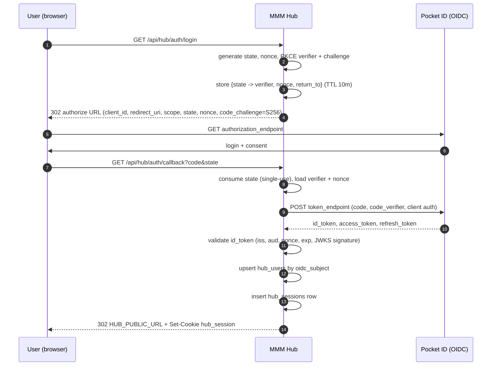

# MMM Hub — Accounts, Sessions & Service Linking

> Written against `plans/mmm-hub/00-interface.md` (frozen contract). Where this
> document needs a name the contract does not fix (OIDC route paths, cookie name,
> state-signing secret), it is called out explicitly as an **open question** at the
> end rather than silently invented.
>
> Scope: **M2** (OIDC login + sessions) and the auth half of **M3** (Spotify link).
> Ingest itself is owned by `data-and-ingest.md`; deployment/TLS by `deployment.md`.

**Status**: draft for review · **Owner**: agent B · **Last updated**: 2026-10-06

---

## 0. Summary of decisions

| Question | Decision | Why |
| -------- | -------- | --- |
| OIDC library | `openidconnect` crate (discovery + PKCE + nonce + ID-token validation) | Handles JWKS, `iss`/`aud`/`nonce`/`exp` checks; avoids hand-rolled JWT verification. |
| Spotify library | `rspotify` 0.15 `AuthCodeSpotify` (same as client) | Contract §1; one shared Spotify app. |
| Session mechanism | Hand-rolled `hub_sessions` table (D4 lean) | Explicit, fewer deps, easy to test; no `tower-sessions` store to configure. |
| OIDC transient state | Server-side ephemeral store (in-memory, TTL 10 min) keyed by `state` | Holds `code_verifier` + `nonce` + `return_to` between authorize and callback; nothing sensitive in the browser. |
| Spotify link `state` | **Signed, single-use** state (HMAC-SHA256) carrying `user_id` | Stateless verification binds the callback to the logged-in user; single-use nonce blocks replay. No new table needed. |
| Token at rest | Plaintext in `hub.db` (D5 v1 lean) + `0600` file perms | LAN friend group; revisit with a hub key later. |
| CSRF for `POST` | `SameSite=Lax` cookie **plus** `Origin`/`Sec-Fetch-Site` check middleware | Lax already blocks cross-site POST cookies; the header check is defence in depth. |

---

## 1. Account login (OIDC / Pocket ID)

### 1.1 Discovery

On boot (and cached, refreshed on `kid` miss), fetch:

```
GET {OIDC_ISSUER}/.well-known/openid-configuration
```

The document yields `authorization_endpoint`, `token_endpoint`, `jwks_uri`,
`issuer`, and the supported `code_challenge_methods_supported` (must include
`S256`). `openidconnect`'s `CoreProviderMetadata::discover_async` does this and
verifies that the returned `issuer` equals `OIDC_ISSUER` (exact string match).

### 1.2 Authorization request

`GET /api/hub/auth/login` (public) builds the authorize URL:

| Param | Value |
| ----- | ----- |
| `response_type` | `code` |
| `client_id` | `OIDC_CLIENT_ID` |
| `redirect_uri` | `OIDC_REDIRECT_URI` (must byte-match the Pocket ID registration) |
| `scope` | `openid profile email` |
| `state` | 32 random bytes, base64url — CSRF binding for the login flow |
| `nonce` | 32 random bytes, base64url — binds the ID token to this request |
| `code_challenge` | `BASE64URL(SHA256(code_verifier))` |
| `code_challenge_method` | `S256` |

`code_verifier` (43–128 chars, high entropy), `nonce`, and an optional
`return_to` are stored server-side under `state` with a 10-minute TTL. The
browser only ever sees `state` and `code_challenge`; the verifier never leaves
the server. The response is a `302` to the `authorization_endpoint`.

### 1.3 Callback

`GET /api/hub/auth/callback?code=…&state=…` (public):

1. Look up `state` in the ephemeral store; **single-use** — delete on read. Miss
   or expiry → `400`.
2. If `error` is present (user denied) → `400` with the OIDC error.
3. Exchange `code` at `token_endpoint` with `code_verifier`, `client_id`,
   `client_secret` (Pocket ID is a confidential client), and the same
   `redirect_uri`. `openidconnect` performs this exchange.
4. Validate the returned `id_token`:
   - **Signature** against `jwks_uri` (RS256/ES256; refresh JWKS on unknown `kid`).
   - **`iss`** == `OIDC_ISSUER` (exact).
   - **`aud`** contains `OIDC_CLIENT_ID`.
   - **`nonce`** == the nonce stored for this `state`.
   - **`exp`** / **`iat`** within clock skew (≤ 60 s).
   - `azp` (if present) == `OIDC_CLIENT_ID`.
5. Upsert `hub_users` (see §1.4).
6. Create a `hub_sessions` row (§2) and set the cookie.
7. `302` to `HUB_PUBLIC_URL` (never to a client-supplied URL — see §4).

### 1.4 `hub_users` upsert

Keyed on `oidc_subject` (the `sub` claim), which is stable per Pocket ID user:

```sql
INSERT INTO hub_users (oidc_subject, display_name, email, created_at)
VALUES (?, ?, ?, ?)
ON CONFLICT(oidc_subject) DO UPDATE SET
    display_name = excluded.display_name,
    email        = excluded.email;
```

`display_name` comes from `preferred_username` / `name` (fallback: `email`
local-part, then `sub`); `email` from the `email` claim when present. `id` is
left to the table default. `created_at` is set only on insert (the `DO UPDATE`
deliberately does not touch it).

### 1.5 Login sequence



---

## 2. Sessions

### 2.1 Migration `002_hub_sessions.sql`

Contract columns are `id`, `user_id`, `created_at`, `expires_at`. One column is
added — `last_seen_at` — to support sliding renewal and idle expiry without a
second table. `id` is a 256-bit random value, base64url-encoded (never a
sequential id, so it is unguessable).

```sql
-- 002_hub_sessions.sql
-- Server-side sessions for MMM Hub. Additive; never touches the client chain.

CREATE TABLE hub_sessions (
    id           TEXT    PRIMARY KEY,          -- 32 random bytes, base64url
    user_id      INTEGER NOT NULL REFERENCES hub_users(id) ON DELETE CASCADE,
    created_at   TEXT    NOT NULL DEFAULT (strftime('%Y-%m-%dT%H:%M:%fZ','now')),
    last_seen_at TEXT    NOT NULL DEFAULT (strftime('%Y-%m-%dT%H:%M:%fZ','now')),
    expires_at   TEXT    NOT NULL              -- created_at + HUB_SESSION_TTL_SECS
);

CREATE INDEX idx_hub_sessions_user_id    ON hub_sessions(user_id);
CREATE INDEX idx_hub_sessions_expires_at ON hub_sessions(expires_at);
```

Timestamps are ISO-8601 UTC text, which sorts lexicographically in chronological
order, so `expires_at < strftime(...)` is a valid expiry predicate. `ON DELETE
CASCADE` means deleting a `hub_users` row revokes its sessions. The FK assumes
`hub_users.id` is an `INTEGER PRIMARY KEY` (rowid alias); if the M1 schema made
it `TEXT`, this column must match — see open questions.

### 2.2 Cookie

| Attribute | Value |
| --------- | ----- |
| Name | `hub_session` |
| `HttpOnly` | yes — JS cannot read it |
| `Secure` | yes (hub is HTTPS-only, see §4) |
| `SameSite` | `Lax` — sent on top-level navigations (OIDC callback), withheld on cross-site POST |
| `Path` | `/` |
| `Max-Age` | `HUB_SESSION_TTL_SECS` (default `2592000` = 30 d) |

`SameSite=Lax` is the primary CSRF control: a cross-site form/fetch `POST` to
`/api/hub/query` or `/sync` will not carry the cookie. `Secure` is mandatory
because the cookie is a bearer credential.

### 2.3 Rotation, logout, expiry

- **Rotation** — on login and on any privilege change (first service link), issue
  a *new* `id`, insert the new row, delete the old row, and re-set the cookie.
  This limits fixation: a pre-login cookie value is never promoted to an
  authenticated session.
- **Sliding renewal** — on each authenticated request, if `last_seen_at` is older
  than a threshold (e.g. 1 h), update it and extend `expires_at` by
  `HUB_SESSION_TTL_SECS`, capped at an absolute maximum (e.g. 90 d) to bound the
  lifetime of a stolen cookie.
- **Logout** — `POST /api/hub/auth/logout` deletes the row and clears the cookie
  (`Max-Age=0`).
- **Expiry cleanup** — a background task (hourly) runs
  `DELETE FROM hub_sessions WHERE expires_at < strftime('%Y-%m-%dT%H:%M:%fZ','now')`.
  The resolver also treats an expired row as absent (lazy check), so cleanup is
  hygiene, not correctness.

### 2.4 Middleware and route classes

`auth_middleware` (axum `middleware::from_fn_with_state`):

1. Read the `hub_session` cookie; missing → unauthenticated.
2. `SELECT … FROM hub_sessions WHERE id = ? AND expires_at > now`.
3. Load the `hub_users` row; insert an `AuthUser { user_id, display_name, email }`
   into request extensions.
4. On miss/expiry: for guarded routes → `401`; for public routes → continue
   unauthenticated.

| Route | Class |
| ----- | ----- |
| `GET /api/hub/health` | public |
| `GET /api/hub/auth/login` | public |
| `GET /api/hub/auth/callback` | public (state-authenticated) |
| `GET /api/hub/services/{service}/callback` | public (state-authenticated, §3) |
| `POST /api/hub/auth/logout` | guarded |
| `GET /api/hub/me` | guarded |
| `POST /api/hub/services/{service}/auth` | guarded |
| `POST /api/hub/services/{service}/sync` | guarded |
| `GET /api/hub/users`, `/tracks/{id}`, `/overlap` | guarded |
| `POST /api/hub/query` | guarded + `HUB_SQL_CONSOLE_ENABLED` |

The two `callback` routes are public at the *cookie* layer because the browser
arrives from a third party; they are authenticated by their `state` parameter
instead. Everything else is guarded. Guarded routes additionally pass the
`Origin`/`Sec-Fetch-Site` CSRF check (§4).

---

## 3. Spotify service linking (per user, one shared Spotify app)

### 3.1 Endpoints

- `POST /api/hub/services/{service}/auth` — guarded; `{service}` ∈ `spotify`
  (others → `501`). Returns `{ "data": { "authorizeUrl": "…" } }`.
- `GET /api/hub/services/{service}/callback?code=…&state=…` — public; `302` back
  to `HUB_PUBLIC_URL`.

### 3.2 State: signed, single-use (recommended)

The callback must bind the returned tokens to the **logged-in** `hub_user`, not
to whoever's browser completes the redirect. Two options:

- **Server-side state table** — a row `state → user_id` with TTL. Simple to
  reason about, but needs a table the frozen schema does not define.
- **Signed state (chosen)** — `state = base64url(payload) . base64url(HMAC-SHA256(payload))`
  where `payload = { user_id, service, nonce, exp }`. The server verifies the
  HMAC with `HUB_STATE_SECRET` and checks `exp`. No new table.

**CSRF reasoning.** An attacker who starts a link flow gets a state signed for
*their own* `user_id`; they cannot forge a state for the victim because they do
not hold `HUB_STATE_SECRET`. So a victim's browser cannot be tricked into
completing a flow that binds the attacker's Spotify account to the victim's hub
user (login/link CSRF). The `nonce` is recorded in the same in-memory ephemeral
store as §1.2 and consumed once, so a captured callback URL cannot be replayed
within its TTL. TTL is 10 minutes.

The Spotify authorize URL carries `state`, `client_id = SPOTIFY_CLIENT_ID`,
`redirect_uri = SPOTIFY_REDIRECT_URI`, `response_type=code`, and the read-only
scopes below. `rspotify`'s `AuthCodeSpotify` also uses PKCE; its per-flow
`code_verifier` is persisted keyed by `state` alongside the nonce.

Scopes (least privilege — v1 is metadata-only, no writes):

```
user-read-private
user-read-email
playlist-read-private
playlist-read-collaborative
user-library-read
```

### 3.3 Callback and token storage

1. Verify state signature, `exp`, and single-use nonce → extract `user_id`.
2. Exchange `code` at Spotify's token endpoint (`rspotify` `request_token`).
3. Fetch `GET /me` for `remote_user_id` (`id`) and `display_name`.
4. Upsert into `hub_service_accounts`:

```sql
INSERT INTO hub_service_accounts
    (user_id, service, remote_user_id, display_name,
     access_token, refresh_token, token_expiry, scopes,
     connected_at, updated_at)
VALUES (?, 'spotify', ?, ?, ?, ?, ?, ?, ?, ?)
ON CONFLICT(user_id, service) DO UPDATE SET
    remote_user_id = excluded.remote_user_id,
    display_name   = excluded.display_name,
    access_token   = excluded.access_token,
    refresh_token  = excluded.refresh_token,
    token_expiry   = excluded.token_expiry,
    scopes         = excluded.scopes,
    updated_at     = excluded.updated_at;
```

`token_expiry` is stored as a Unix timestamp (seconds), matching the client's
`update_service_tokens` convention. `connected_at` is preserved on re-link.
Tokens are plaintext (D5 v1); `hub.db` is created `0600`.

### 3.4 Refresh handling

`rspotify`'s `AuthCodeSpotify` is constructed per request from the stored row
with `auto_refresh = true`. Before any ingest call, if `token_expiry` is within a
60 s skew of now, call `refresh_token`; on success write the new
`access_token`/`token_expiry` (and `refresh_token` if rotated) back to
`hub_service_accounts.updated_at`. A `401`/`invalid_grant` from Spotify marks the
account as needing re-link (clear tokens, keep the row so `/api/hub/me` can
report `connected: false`). Refresh is owned by `ingest/spotify.rs`; this doc
fixes only the storage contract.

### 3.5 Link sequence

```mermaid
sequenceDiagram
    autonumber
    participant U as User (browser)
    participant H as MMM Hub
    participant S as Spotify

    U->>H: POST /api/hub/services/spotify/auth (session cookie)
    H->>H: resolve session -> user_id
    H->>H: sign state {user_id, service, nonce, exp}; store nonce (single-use)
    H-->>U: 200 { authorizeUrl }
    U->>S: GET accounts.spotify.com/authorize (client_id, redirect_uri, scope, state)
    S->>U: consent
    U->>H: GET /api/hub/services/spotify/callback?code&state
    H->>H: verify state HMAC + exp + nonce -> user_id
    H->>S: POST accounts.spotify.com/api/token (code, client auth)
    S-->>H: access_token, refresh_token, expires_in
    H->>S: GET /me (remote_user_id, display_name)
    S-->>H: profile
    H->>H: upsert hub_service_accounts (user_id, spotify)
    H-->>U: 302 HUB_PUBLIC_URL
```

---

## 4. Security notes

- **State / PKCE / nonce.** Login uses `state` (CSRF), `nonce` (ID-token
  binding), and PKCE `S256` (code interception). Spotify link uses signed,
  single-use `state`; PKCE is applied by `rspotify`. All transient values live
  server-side with a 10-minute TTL and are consumed once.
- **Cookie CSRF for `POST`.** `SameSite=Lax` withholds the session cookie on
  cross-site `POST`, which covers `/api/hub/query` and `/sync`. As defence in
  depth, guarded `POST` handlers reject requests whose `Origin` is not
  `HUB_PUBLIC_URL` (or whose `Sec-Fetch-Site` is `cross-site`). No separate CSRF
  token is required for v1; if a token is added later it must be a
  double-submit cookie, not a query param.
- **Token storage at rest.** D5 v1: plaintext in `hub.db`, file mode `0600`,
  DB on the LAN host only. Encryption with a hub key is a later milestone; the
  schema already isolates tokens in `hub_service_accounts`, so adding a KMS/key
  wrapper is a storage-layer change, not a schema change.
- **Open redirect.** The callbacks redirect only to the fixed `HUB_PUBLIC_URL`.
  If a `return_to` is ever honoured, it must be validated against an allowlist of
  hub paths (relative, no scheme/host) — never reflected verbatim.
- **HTTPS.** `Secure` cookies, the `Secure`-only session, and the Spotify
  `SPOTIFY_REDIRECT_URI` all require TLS. The hub must be reached over HTTPS
  (reverse proxy / Caddy per `deployment.md`); plain HTTP is dev-only and must
  not set `Secure` cookies. `HUB_PUBLIC_URL` must be the HTTPS origin so cookie
  and redirect scopes line up.
- **Secrets.** `OIDC_CLIENT_SECRET`, `SPOTIFY_CLIENT_SECRET`, and
  `HUB_STATE_SECRET` are env-only, never logged, never returned by any endpoint.
- **Least privilege.** Spotify scopes are read-only; the hub never mutates a
  user's Spotify library in v1.

---

## 5. Test strategy

All tests run against an in-process axum app with a fresh in-memory SQLite DB and
the M1 seed fixtures — no live Pocket ID, no live Spotify.

### 5.1 OIDC login without a live issuer

- **Mock issuer.** A test-only axum server (or `tower::ServiceExt` router) serves
  `/.well-known/openid-configuration`, `/jwks`, `/authorize`, and `/token`. A
  generated RSA keypair signs the `id_token`; the JWKS exposes its public key.
  `OIDC_ISSUER` points at this server, so `openidconnect` discovery and
  validation run for real.
- **Happy path.** Drive `GET /api/hub/auth/login` → follow the `302` to
  `/authorize` → the mock redirects to `/api/hub/auth/callback?code&state` →
  assert `302` to `HUB_PUBLIC_URL`, a `Set-Cookie: hub_session`, a new
  `hub_users` row keyed by `oidc_subject`, and a `hub_sessions` row.
- **Negative cases.** Wrong `nonce` → `400`; wrong `aud` → `400`; wrong `iss` →
  `400`; expired `id_token` → `400`; unknown/expired `state` → `400`; replayed
  `state` → `400`; `error=access_denied` → `400`.
- **Upsert idempotence.** Two logins with the same `sub` produce one
  `hub_users` row with updated `display_name`/`email` and unchanged `id`.

### 5.2 Guard middleware

- `GET /api/hub/me` with no cookie → `401`.
- With a valid session cookie → `200` and the correct user.
- With an expired session row → `401`.
- After `POST /api/hub/auth/logout` → the same cookie is `401` and the row is
  gone.
- `GET /api/hub/health` → `200` without a cookie.
- Cross-site `POST /api/hub/query` (foreign `Origin`) → `403` even with a valid
  cookie.

### 5.3 Spotify link state binding

- **Unit.** Sign/verify round-trip; tampered payload → reject; expired `exp` →
  reject; wrong `HUB_STATE_SECRET` → reject.
- **Integration.** With a mock token endpoint (inject a `SpotifyOAuth` trait
  impl, or override `rspotify`'s token URL via `Config`), complete the link and
  assert the tokens land on the *initiating* `user_id` in
  `hub_service_accounts`.
- **Cross-user attack.** A state signed for user A, replayed in user B's browser,
  binds to A (never B); a forged state (no valid HMAC) → `400`.
- **Replay.** The same `state` used twice → second attempt `400`.
- **Re-link.** Linking the same user twice updates the row (no duplicate, per
  `UNIQUE(user_id, service)`), preserving `connected_at`.
- **Refresh.** A stored token past expiry triggers `refresh_token`; the new
  `access_token`/`token_expiry` are persisted; `invalid_grant` clears tokens and
  `/api/hub/me` reports `connected: false`.

### 5.4 Migration integrity

A dedicated test creates a fresh DB, runs `001` + `002` end-to-end, and asserts
`hub_sessions` exists with the expected columns, indexes, and FK cascade.

---

## 6. Open questions for the coordinator

1. **OIDC route paths.** The frozen §3 table does not list the login endpoints.
   This doc uses `GET /api/hub/auth/login`, `GET /api/hub/auth/callback`, and
   `POST /api/hub/auth/logout`. Confirm or rename before M2.
2. **`HUB_STATE_SECRET`.** Not in the §4 config table. Needed to sign Spotify
   link state. Proposal: add `HUB_STATE_SECRET`; fallback to a random per-boot
   value (invalidates in-flight link flows on restart, which is acceptable).
3. **`hub_users.id` type.** The `hub_sessions.user_id` FK assumes `INTEGER
   PRIMARY KEY`. If M1 chose `TEXT`, the FK column type must match.
4. **Session idle/absolute caps.** `last_seen_at` sliding renewal is proposed
   with a 1 h touch threshold and a 90 d absolute cap; confirm the numbers.
5. **`return_to`.** Whether the login flow should honour a post-login return path
   at all, or always land on `HUB_PUBLIC_URL`.

These are the only places this document could not follow the contract verbatim;
everything else (paths, table/column names, env keys) is taken directly from
`00-interface.md`.
