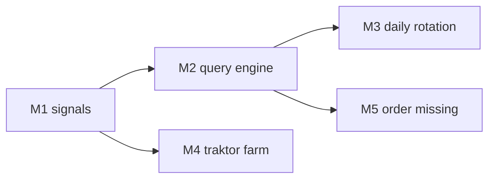

# Plan: rediscovery-engine ("Daily Re-Discovery")

**Status**: proposed
**Branch**: `feat/rediscovery-engine`
**Ready for review**: no
**Depends on**: nothing
**Migration needed**: yes — one per phase, consolidate into the earliest new
migration at release time.

### Description

Resurface forgotten music. The core signal is **`last_added_at`**: when a track
was last added to _any_ of my playlists. That's the last time I had it in my
hands. Tracks that were last touched years ago get rolled up from the back and
looked at again — now that the workflow is "10–20 playlists per track" instead of
"2–3", the old music is exactly the stuff that never got re-sorted.

Output: **rotating daily Spotify playlists** — `Today's Selection`,
`Yesterday's Selection`, `2 Days Ago` — so there is always something fresh to
listen to and the last few days stay available.

Two supporting goals:

1. **Liked Songs as a first-class signal.** `/me/tracks` is synced into a
   `liked` playlist (and is allowed to be a **tag** — handy to filter/see).
2. **Traktor-grade BPM + key everywhere.** A real Traktor instance runs on the
   LAN server (Wine/Xvfb, VM fallback) so analysis no longer needs the MacBook
   detour. Keys/BPM must match what Traktor would produce on my Mac — other CLIs
   were tried and disagreed, Traktor is the reference.

### Reality check (verified in the codebase, 2026-10-01)

| Assumption in the idea                  | Reality                                                                                                                                                                                                                             |
| --------------------------------------- | ----------------------------------------------------------------------------------------------------------------------------------------------------------------------------------------------------------------------------------- |
| "Likes is always at least one playlist" | **Not synced.** `global_poller` only calls `GET /me/playlists`; Likes live behind `GET /me/tracks`. → **M1**                                                                                                                        |
| "Track is only in one playlist"         | ✅ `service_playlist_tracks` (PK `playlist_id, track_id`), with `added_at`                                                                                                                                                          |
| "When did I last touch this track?"     | ✅ `MAX(added_at)` across playlists. **This is the primary signal** — not listening history.                                                                                                                                        |
| "Tracks I played in 2023"               | ⚠️ Spotify exposes **no listening history**. `last_added_at` is the agreed proxy; Traktor's `play_count`/`last_played` are a secondary hint.                                                                                        |
| BPM + key per track                     | ⚠️ Only on `files`, linked via `v_file_track_link`. Must come from Traktor for accuracy. → **M4**                                                                                                                                   |
| Headless Traktor on the server          | ✅ **In scope.** Real Traktor in Wine + Xvfb (or a Windows VM), with its own `collection.nml` imported through the existing basename-matching path. CLI analyzers were already tried and produced divergent keys — not the default. |
| Generate + push a Spotify playlist      | ✅ Already built: `src/api/daily.rs`, `push_playlist_to_spotify()`                                                                                                                                                                  |
| Order missing music                     | ✅ `music-api` crate (`POST /orders` per ISRC) + `music_api_imports` ledger                                                                                                                                                         |
| Genre available                         | ⚠️ `files.genre` exists, but only for local/tagged files — Spotify-only tracks have no genre                                                                                                                                        |

### Milestones

| #   | Milestone             | Outcome                                                                         | Migration |
| --- | --------------------- | ------------------------------------------------------------------------------- | --------- |
| M1  | Library signals       | Liked Songs synced (`liked` playlist + tag); `last_added_at` computable         | 032       |
| M2  | Query engine          | `GET /api/rediscovery/candidates` — facets, reasons, preview UI                 | 033       |
| M3  | Daily rotation        | `Today's Selection` / `Yesterday's Selection` / `2 Days Ago` + scheduler + push | —         |
| M4  | Traktor Analysis Farm | Real Traktor on the server, BPM/key for everything, calibrated against Traktor  | 034       |
| M5  | Order missing tracks  | Order liked/playlisted-but-unowned tracks via music-api                         | —         |



M1 → M2 → M3 are sequential. M4 needs M1/M2 (it needs to know which files are
in the rediscovery pool) but not M3. M5 needs M2 only.

---

## M1 — Library signals

> Detailed plan: [`liked-songs-sync.md`](liked-songs-sync.md)

### M1.1 Liked Songs sync (`/me/tracks`)

Verified API (rspotify 0.15.1 → `rspotify-model` 0.15.1):

- `current_user_saved_tracks_manual(market, limit, offset) -> Page<SavedTrack>`
  — `Page` carries `total` (for removal detection), `SavedTrack { added_at, track }`.
- `current_user_saved_tracks_contains(track_ids) -> Vec<bool>` — cheap re-check.

Implementation:

- `SpotifyClient::get_saved_tracks()` wrapping the manual variant (paged, 50/page).
- Upsert one `service_playlists` row: `service='spotify'`, `playlist_id='spotify:liked'`,
  `name='liked'`, `playlist_kind='liked'`, `last_fetched_at`, `remote_track_count`.
- Upsert `service_playlist_tracks` with Spotify's `added_at` (**the like date**).
- Removal detection: compare `/me/tracks` `total` with the stored count; walk
  newest-first and stop at the first already-known timestamp; full pass when
  `total` shrinks. Unlike → soft-delete the membership row.

### M1.2 `liked` is a real tag

Decision: **yes**, `liked` becomes a tag — it is genuinely useful to filter on
"is this liked". This means `create_tags_from_playlists` keeps working unchanged
for the liked playlist; no special-casing.

The existing **manual mirror playlist** (they always dragged likes into a
playlist called "liked"/"Likes") is folded in: migration backfill marks any
playlist named `liked`/`likes` as `playlist_kind='liked'`, so it doesn't
double-count.

### M1.3 `playlist_kind` (Migration 032)

```sql
ALTER TABLE service_playlists ADD COLUMN playlist_kind TEXT NOT NULL DEFAULT 'curated';
-- values: 'curated' | 'liked' | 'generated'

-- backfill: the manual likes mirror playlist
UPDATE service_playlists SET playlist_kind = 'liked'
 WHERE LOWER(TRIM(name)) IN ('liked', 'likes');

-- backfill: our own generated playlists never count as curation
UPDATE service_playlists SET playlist_kind = 'generated'
 WHERE service = 'local' AND name LIKE 'Daily-%';

CREATE INDEX idx_service_playlists_kind ON service_playlists(playlist_kind);
```

Only the known `Daily-%` prefix is matched by name. M3 sets
`playlist_kind='generated'` explicitly when it creates a pack, so no fragile
name matching is needed for the new names (`Today's Selection`, …).

`playlist_count` counts **only** `playlist_kind='curated'`: likes are the
baseline everyone shares, and generated playlists are our own output — counting
either would make a track look "well used" and it would never come back around.

### M1.4 Forgotten-facets helper (`src/db/rediscovery.rs`)

| Field                                                      | Source                                                                      |
| ---------------------------------------------------------- | --------------------------------------------------------------------------- |
| `playlist_count`                                           | distinct **curated** playlists, active membership per ADR-072 guard         |
| `last_added_at`                                            | `MAX(added_at)` across **all** playlists (curated + liked) — "last touched" |
| `liked`, `liked_at`                                        | membership in the liked playlist                                            |
| `in_backpack`                                              | `tags.backpack` via name match (reuse `src/backpack.rs`)                    |
| `bpm`, `musical_key`, `genre`, `play_count`, `last_played` | `files` via `v_file_track_link`                                             |
| `owned`                                                    | local `file_locations` / `music_api_imports` status                         |

### M1 — Acceptance criteria

- [ ] Liked tracks + their `added_at` land in `service_playlist_tracks`
- [ ] A `liked` tag exists and is selectable/filterable like any other tag
- [ ] Sync is idempotent (`added_at` preserved, no duplicate rows); unlike is detected
- [ ] Manual "liked"/"Likes" playlist backfilled to `playlist_kind='liked'`
- [ ] `playlist_count` ignores both `liked` and `generated`
- [ ] Integration tests in `tests/api_playlists.rs` + `tests/api_tracks.rs`
- [ ] `cargo build` + `cargo test` pass

---

## M2 — Rediscovery query engine

### Endpoint — `GET /api/rediscovery/candidates`

```jsonc
{
  "touchedBeforeDays": 365, // PRIMARY: last_added_at older than now - N days
  "maxPlaylists": null, // secondary: playlist_count <= N (null = off)
  "likedOnly": false,
  "excludeBackpack": true,
  "excludePushedSinceDays": 180,
  "playCountMax": null,
  "notPlayedSinceDays": null,
  "requireBpm": false,
  "requireKey": false,
  "bpmMin": null,
  "bpmMax": null,
  "keys": [],
  "genres": [],
  "limit": 50,
  "offset": 0,
  "seed": null,
  "sort": "oldest-touched", // oldest-touched | forgotten | random | bpm | artist
}
```

Response rows carry the reasons they surfaced (explainable UI):

```jsonc
{
  "trackId": 123,
  "spotifyId": "spotify:track:...",
  "title": "...",
  "artist": "...",
  "playlistCount": 1,
  "likedAt": 1690000000,
  "lastAddedAt": 1610000000,
  "touchedYearsAgo": 5.6,
  "bpm": 124.0,
  "musicalKey": "8m",
  "genre": "House",
  "inBackpack": false,
  "owned": true,
  "reasons": ["last-touched-2021-02-04", "only-in-1-playlist", "never-pushed"],
}
```

- Default sort is `oldest-touched`: roll up from the back, longest untouched
  first. `forgotten` blends `last_added_at` age with `playlist_count`.
- `GET /api/rediscovery/stats` — matches for the current preset, split into
  has-BPM/key vs needs-analysis vs not-owned.

### Anti-repeat ledger (Migration 033)

`rediscovery_pushes(track_id, playlist_id, pushed_at, facet_json, slot)` —
`excludePushedSinceDays` works across runs, and `slot` (0 = today, 1 =
yesterday, …) drives the M3 naming. An explicit ledger survives playlist
pruning, which deriving from playlist contents would not.

### Frontend

`frontend/pages/rediscovery.js` — facet form + live preview table with reason
chips + counts bar. Register in `PAGE_MAP` (`frontend/app.js`) **and**
`TOOLS_ITEMS` (`frontend/shared/nav.js`).

### M2 — Acceptance criteria

- [ ] Every facet has an integration test in `tests/api_rediscovery.rs`
- [ ] `touchedBeforeDays` uses `last_added_at` across curated **and** liked playlists
- [ ] `liked` and `generated` never count towards `playlist_count`
- [ ] Backpack excluded by default; `reasons` match the applied facets
- [ ] Seeded shuffle reproducible (same seed → same order)
- [ ] `#rediscovery` renders, filters, shows reasons; zero `pageerror`
- [ ] Playwright `frontend/tests/rediscovery.spec.js` + seed scenario in
      `src/db/testing.rs` registered in `testing_seed_handler`
- [ ] `cargo build` + `cargo test` + `npx playwright test` pass

---

## M3 — Daily rotation ("Today's Selection")

### Naming & rotation

Keep **3** daily playlists, named relative to today:

| Slot | Name                    |
| ---- | ----------------------- |
| 0    | `Today's Selection`     |
| 1    | `Yesterday's Selection` |
| 2    | `2 Days Ago`            |

Each run: create the new pack → rename slot 1→2, 0→1, new→0 → prune beyond
`keepLast`. Renaming a pushed playlist on Spotify uses
`playlist_change_detail(PlaylistId, name, public, description, collaborative)`
(write scope is already granted from the daily-tagging-queue work). Names are
derived from `rediscovery_pushes.slot`, so it survives restarts and is
idempotent.

`generated` playlists are excluded from tag creation (via `playlist_kind`), so
the rotating names never leak into the tag list.

### Endpoint — `POST /api/rediscovery/generate`

```jsonc
{
  "preset": "balanced", // balanced | bpmBuckets | keyBalanced | likedOnly | byGenre
  "size": 30,
  "push": true,
  "public": false,
  "cooldownDays": 180,
  "keepLast": 3,
}
```

Presets shape selection **and ordering**:

- `balanced` — spread across BPM buckets, ordered ascending BPM (flows front-to-back)
- `bpmBuckets` — one pack per tempo bucket so I can pick a tempo and go
- `keyBalanced` — round-robin over the 24 Camelot keys (cf. `dynamic_bundles.diversify_keys`)
- `likedOnly` — "liked it and never touched it"
- `byGenre` — pack per `files.genre`

### Scheduler

`src/rediscovery_scheduler.rs` — maintainer-style daily loop, cancellable,
writes a task-history row. Settings (existing `settings` KV table):

| Key                               | Default                                                                         |
| --------------------------------- | ------------------------------------------------------------------------------- |
| `rediscovery.enabled`             | `false`                                                                         |
| `rediscovery.hour`                | `7`                                                                             |
| `rediscovery.size`                | `30`                                                                            |
| `rediscovery.touched_before_days` | `365`                                                                           |
| `rediscovery.cooldown_days`       | `180`                                                                           |
| `rediscovery.keep_last`           | `3`                                                                             |
| `rediscovery.preset`              | `balanced`                                                                      |
| `rediscovery.name_style`          | `relative` (`relative` = Today's/Yesterday's, `date` = `Rediscover YYYY-MM-DD`) |

### M3 — Acceptance criteria

- [ ] Generate creates a local playlist of exactly `size` (or fewer if the pool
      is smaller) and pushes to Spotify; `spotifyUrl` returned
- [ ] Rotation renames correctly: after 3 consecutive runs the three names are
      exactly slot 0/1/2, and there are never more than `keepLast` packs
- [ ] Rename propagates to Spotify via `playlist_change_detail`
- [ ] Every preset produces its documented ordering
- [ ] Cooldown: a pushed track never reappears within `cooldownDays`
- [ ] Scheduler fires once per day at `rediscovery.hour`, honours
      `rediscovery.enabled`, is cancellable
- [ ] Settings round-trip via the settings API + tests
- [ ] Playwright: generate, rotation labels, result card, history, settings
- [ ] `cargo build` + `cargo test` + `npx playwright test` pass

---

## M4 — Traktor Analysis Farm (server-side)

Goal: **Traktor-grade BPM/key for everything**, without the MacBook detour.
Traktor is the reference analyser — other CLIs were tried and disagreed on key
(and sometimes BPM), so they are explicitly **not** the default.

### M4.1 Where Traktor runs (investigation, in order)

1. **Traktor in Wine + Xvfb on the LAN box** (first choice — cheapest, all on
   the existing server).
   - Needs a virtual X display with software rendering; no audio device.
   - Traktor's "analyze on import" for the watched music folder.
   - Known risk: Wine stability across Traktor versions. Pin the version.
2. **Windows VM** (fallback): QEMU/KVM (headless) with a shared library folder.
   Heavier, but the most faithful behaviour.

Both produce the same artefact, so the rest of the pipeline doesn't care which
one wins.

### M4.2 The farm gets its own `collection.nml`

The farm's Traktor is a **separate collection** from the MacBook's. That is a
feature: `src/traktor.rs::run_import(db, Some(&path))` already accepts a custom
NML path, and basename matching is on main — so the farm's output imports with
**no new import code**, just a second source path.

- Provenance must distinguish the two: `bpm_source`/`key_source` =
  `'traktor'` for both, plus which collection (`macbook` vs `farm`).
- Precedence: MacBook Traktor > farm Traktor > any computed value.

### M4.3 Orchestration

`TaskType::AnalyzeFiles` (new): pick a bounded batch of files needing analysis →
ensure the farm sees them → run the launch/analyze/quit cycle → import the
farm NML → record results. Cancellable, resumable, batch-size configurable.

The hard part is **knowing when Traktor is done**. Preferred signal: poll the
NML until it stops changing _and_ the batch's entries all have analysis flags.
Avoid blind keyboard automation (`xdotool`) unless polling proves unreliable.

Also useful while the farm is being built: `GET /api/analysis/status` (how many
files still need BPM/key, by format/folder) so a batch can be chosen by hand.

### M4.4 Calibration (non-negotiable)

Even Traktor-under-Wine must be validated: compare farm results against the
~2,920 files the MacBook Traktor already analysed.

- `GET /api/analysis/calibration` → agreement rate for BPM (±1) and key.
- Success bar: key agreement ≥ 95 %, BPM within ±1. Below that, the farm is not
  trusted and we fall back to the existing `scripts/lab-stage.sh` MacBook flow.

### M4 — Acceptance criteria

- [ ] ADR in `docs/DECISIONS.md`: Wine vs VM verdict, pinned Traktor version,
      calibration numbers, and why CLI analyzers are not the default
- [ ] Farm produces a `collection.nml` that imports via `run_import(Some(path))`
      with basename matching
- [ ] Migration 034: `files.bpm_source`, `files.key_source`, `files.analyzed_at`,
      `files.analysis_collection` (`NULL | 'macbook' | 'farm'`)
- [ ] MacBook Traktor import overrides farm values; farm never overrides MacBook
- [ ] Analysis worker is bounded, cancellable, resumable, and skips files without
      a resolvable path
- [ ] `GET /api/analysis/status` + `GET /api/analysis/calibration` (with tests)
- [ ] Existing `scripts/lab-stage.sh` flow still works (documented fallback)
- [ ] `cargo build` + `cargo test` pass

---

## M5 — Order what I don't own

- `POST /api/rediscovery/order-missing` — candidate track IDs in, filter to ISRCs
  that are neither owned nor already in `music_api_imports`, place **one**
  music-api order (reuses `src/music_api.rs` + `music_api_consumer.rs`).
- `#rediscovery` page gets an "Order missing" action, driven by `notOwned` from
  `GET /api/rediscovery/stats`.

### Acceptance criteria

- [ ] Orders exactly the unowned ISRCs, no duplicates, no-ops when nothing is missing
- [ ] Integration tests for the endpoint
- [ ] Playwright: the button appears only when `notOwned > 0` and shows the count
- [ ] `cargo build` + `cargo test` + `npx playwright test` pass

---

### Out of scope

- Spotify listening history (does not exist via API) — `last_added_at` is the signal.
- Predicting genre for Spotify-only tracks.
- Automatically re-tagging or re-writing comments of rediscovered tracks.
- Multi-provider push (SoundCloud/YouTube OAuth still unimplemented).
- CLI analyzers (essentia/libkeyfinder) as a _default_ path — they were tried and
  disagreed with Traktor on key.

### Open questions

- Cooldown: global, per-preset, or per-BPM-bucket?
- Should the manual "liked" mirror playlist stay alongside the `/me/tracks` sync,
  or be retired once the sync is trusted?
- Farm: analyze in place on the library, or stage files into a farm folder?
- Traktor licence/EULA for a second automated instance — confirm before M4 ships.
- Liked-but-unowned tracks: auto-order, or always a click?

### Agent decomposition (per phase, disjoint file sets)

| Phase | Files                                                                                                                                                                                                                                                            |
| ----- | ---------------------------------------------------------------------------------------------------------------------------------------------------------------------------------------------------------------------------------------------------------------- |
| M1    | `src/spotify/client.rs`, `src/global_poller.rs`, `src/db/playlists.rs`, `src/db/rediscovery.rs`, `migrations/032_*.sql`, `tests/api_playlists.rs`                                                                                                                |
| M2    | `src/api/rediscovery.rs`, `src/api/mod.rs`, `src/db/rediscovery.rs`, `migrations/033_*.sql`, `tests/api_rediscovery.rs`, `src/db/testing.rs`, `frontend/pages/rediscovery.js`, `frontend/app.js`, `frontend/shared/nav.js`, `frontend/tests/rediscovery.spec.js` |
| M3    | `src/api/rediscovery.rs`, `src/rediscovery_scheduler.rs`, `src/main.rs`, `frontend/pages/rediscovery.js`, `tests/api_rediscovery.rs`                                                                                                                             |
| M4    | `src/analysis/*` (new), `src/traktor.rs`, `src/external_tools.rs`, `src/api/analysis.rs`, `migrations/034_*.sql`, `scripts/traktor-farm/*`, `docs/DECISIONS.md`                                                                                                  |
| M5    | `src/api/rediscovery.rs`, `src/music_api.rs`, `frontend/pages/rediscovery.js`, `tests/api_rediscovery.rs`                                                                                                                                                        |
